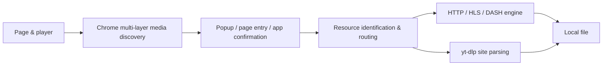
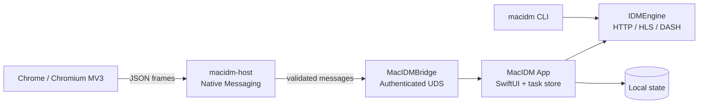

<div align="center">
  
  <h1>MacIDM</h1>
  <p><a href="README.md">简体中文</a></p>
  <p><strong>A Swift-native, macOS-first, low-memory general-purpose download manager in the spirit of IDM</strong></p>
  <p>Find the video, audio, and files hidden inside web pages, confirm them in a native app, and land them locally with a reliable, controllable, privacy-friendly download engine.</p>
  <p>
    
    
    
    
  </p>
  <p>
    <a href="https://github.com/Raters0/MacIDM/releases/tag/v1.0.0"><strong>Download v1.0.0</strong></a> ·
    <a href="#quick-start"><strong>Quick start</strong></a> ·
    <a href="#2-load-the-chrome-extension"><strong>Chrome extension</strong></a>
  </p>
  <p></p>
</div>

## Contents

- [Why MacIDM](#why-macidm)
- [From web page to local file](#from-web-page-to-local-file)
- [Core capabilities](#core-capabilities)
- [Design trade-offs vs. common approaches](#design-trade-offs-vs-common-approaches)
- [Interface](#interface)
- [yt-dlp and video downloads](#yt-dlp-and-video-downloads)
- [How it works](#how-it-works)
- [Quick start](#quick-start)
- [Usage guide](#usage-guide)
- [CLI and local Agent API](#cli-and-local-agent-api)
- [Building from source](#building-from-source)
- [Testing](#testing)
- [Repository layout](#repository-layout)
- [Privacy and local data](#privacy-and-local-data)
- [Acknowledgements and license](#acknowledgements-and-license)

## Why MacIDM

Downloading looks different depending on what you're after. MacIDM is designed around three real needs:

**Ordinary large files.** You want segmented transfer that saturates your bandwidth, resume that survives interruptions, speed limits that don't starve the rest of your network, a queue that drains in order, and a dependable local task manager. These are the fundamentals, and MacIDM makes them verifiable: it probes with HTTP Range and validates responses before enabling multi-connection transfer; it uses strong ETags and content identity to make sure a resume is really the same resource; and it writes with absolute offsets so concurrent connections never trample each other.

**Video and audio on the web.** The real address is rarely on the page — it hides in network requests, player state, HLS/DASH manifests, or JSON returned by an API. MacIDM lets the Chrome extension do the *discovery*, hands the candidates to you, and lets the native app do the *confirming and downloading*. You always make the final call: discovering a candidate never silently starts a download.

**Automation and developer workflows.** You may want to drive downloads from a CLI or a local API without leaking page titles, URLs, local paths, and credentials into logs or AI debugging context. MacIDM's logging and automation interfaces default to data minimization, exposing structured state and cleaned summaries.

In one line:

> The browser **discovers**, the native app **downloads**, and the user **confirms**.

MacIDM is neither a link-collecting browser extension nor a standalone downloader detached from the browser. It connects web-media entry points, a reliable download core, and native macOS task management into one complete, controllable pipeline.

## From web page to local file

Media sniffing is MacIDM's signature entry point. Media addresses on the web come from many places, and any single technique misses some, so the extension layers several discovery channels:

1. **Browser network-request observation** — see the media requests the page actually makes;
2. **Main-world `fetch` / XHR observation** — capture requests issued by page scripts in the main world;
3. **Response-type and magic-byte checks** — look at real bytes, not just declared MIME types;
4. **Deep JSON scanning** — dig media addresses out of nested API responses;
5. **DOM / Performance resource observation** — a fallback that catches player and resource-loading traces.

Discovery is only the first step. The extension **normalizes candidates, scores confidence, and deduplicates** so the same resource isn't listed twice. You can reach them through three entry points: the toolbar **Popup**, the **collapsed floating button** next to a media element, and **Download All** for scanning every link on a page. Whichever you use, **discovery never silently starts a download**; you confirm the name, destination, and options in the MacIDM confirmation window before a task is created.

The extension talks to the local app through a **Native Messaging Host**. The local bridge uses a whitelist-validated protocol over authenticated local transport (Unix Domain Socket), and the extension cannot read or write the app's internal task store directly.

Once a resource enters the pipeline, it is routed by type:



- **Ordinary files** use the HTTP segmented engine: Range probing, segmented concurrency, resume, SHA-256 verification, and atomic publication of the final file;
- **HLS** downloads by segment plan, supports AES-128 decryption and byte-range segments, then remuxes to MP4 with FFmpeg;
- **Static DASH** pairs and merges audio/video tracks;
- **Bilibili** has a dedicated adaptation path;
- **YouTube and similar sites** are handled by yt-dlp (see below).

## Core capabilities

| Module | Capability | Notes |
| --- | --- | --- |
| Download engine | HTTP segmentation, Range validation, strong ETags, resume, retry, SHA-256, absolute-offset writes | Segmentation is enabled only after response validation; existing final files are never silently overwritten |
| Concurrency & rate limiting | 1–64 concurrent requests, slow-segment re-splitting, connection-policy adaptation on 429/503, global and per-task token-bucket limits | Concurrency and limits are configurable per task or globally |
| macOS app | SwiftUI task UI, queues, pause/resume, proxy, completion actions, search & categories, English/Chinese | The center for confirmation and local management |
| Media paths | HLS VOD, static DASH, Bilibili, yt-dlp site parsing, FFmpeg/ffprobe verification | DRM and live streams are out of scope |
| Chrome extension | MV3 Popup, multi-layer discovery, floating entry, Download All, download takeover | Discovers; never downloads silently |
| Local bridge | Native Messaging + authenticated UDS + strict JSON protocol | The only channel between extension and app |
| CLI | `add` / `status` / `pause` / `resume` / `cancel` / `inspect` / `watch` / `logs`, JSON output | Shares the engine's core models; no UI dependency |
| Automation | localhost Agent HTTP API, state snapshots | See [docs/agent-http-api.md](docs/agent-http-api.md) |

## Design trade-offs vs. common approaches

MacIDM doesn't try to "beat" anyone on every axis; it makes a deliberate set of product trade-offs:

| Type | Common strengths | MacIDM's trade-off |
| --- | --- | --- |
| In-browser download extensions | Easy link collection, simple deployment | The extension focuses on discovery; downloading is delegated to a native engine for segmentation, resume, rate limiting, queues, verification, and custom requests |
| Media-sniffing extensions | Flexible rules, mature batch management | Multi-layer discovery with confidence scoring and dedup, handing candidates to the app for confirmation instead of downloading in-page |
| Traditional cross-platform downloaders | Broad features, wide platform coverage | Swift / SwiftUI focused on macOS, emphasizing native feel, streaming processing, and bounded memory |
| Video download tools | Wide site coverage | Uses yt-dlp as a key site-parsing capability, integrated with the app, extension, and task management rather than bolted on |

Behind these trade-offs is a set of verifiable implementations: HTTP Range probing and response validation, 1–64 configurable concurrency, strong-ETag/content-identity resume, slow-segment re-splitting, connection-policy adaptation on 429/503, global and per-task token-bucket rate limiting, queue scheduling, SHA-256 verification with atomic final-file publication, HLS AES-128 / byte-range, static DASH audio/video pairing and merging, a Bilibili adaptation path, and a managed yt-dlp tool path.

## Interface

**Main window.** A three-column layout: a filter sidebar (status, queues, time, categories), a task list (size, status, speed, duration, progress), and a task detail pane (overall progress, segment progress, speed curve, connection policy). The screenshot below is the real interface with filename redaction enabled for privacy.

<p align="center"></p>

**Media discovery and confirmation.** After an HLS/DASH address is entered or sniffed, the app parses the available variants and lists resolution, bitrate, and estimated size so you can pick one before confirming. The screenshot below uses a public test stream.

<p align="center"></p>

**Chrome Popup.** A lightweight popup showing the current page's media candidates, with per-item download buttons, refresh, and "download all on this page", plus theme and English/Chinese options. The image below is an interface preview.

<p align="center"></p>

> Note: the screenshots and preview above use neutral sample data (e.g. `example.com`, public test streams) and contain no real download history, URLs, local paths, or sensitive titles. The Popup image is a layout preview, not a live screenshot.

## yt-dlp and video downloads

YouTube and many other sites have complex, frequently changing media-address and format-selection logic. Rather than reinventing that wheel, MacIDM uses **[yt-dlp](https://github.com/yt-dlp/yt-dlp)** as a key site-parsing capability: yt-dlp is a feature-rich command-line project covering a large number of sites, and MacIDM uses and manages it for media parsing and download paths on YouTube and similar sites (the release app ships a managed yt-dlp binary and can also fall back to a locally installed copy at runtime).

More importantly, it's integrated: candidates parsed by yt-dlp flow through MacIDM's unified pipeline — browser discovery, app confirmation, quality selection, progress display, and local task management — instead of being an isolated command-line call.

Thanks to the [yt-dlp](https://github.com/yt-dlp/yt-dlp) project and its contributors for providing an essential foundation for site media parsing and video downloads. yt-dlp and its upstream dependencies remain subject to their own licenses.

## How it works



The layers are separated by long-term responsibility: `IDMEngine` is a reusable, UI-free download core with no dependency on the CLI or UI; `MacIDMBridge` owns only the message protocol, validation, and authenticated transport; `MacIDMHost` only forwards Native Messaging traffic; and page discovery stays separate from Popup presentation. Dependencies converge in one direction, which keeps the system testable and maintainable.

**How low memory is achieved.** MacIDM is written in native Swift / SwiftUI with no cross-platform runtime overhead; HLS/DASH are processed as streams, writing segments to disk as they arrive instead of loading whole media into memory; and media buffering is governed by `MediaBufferBudget`, a bounded two-phase reservation (per-task plus global) whose global budget automatically tightens or relaxes based on the machine's physical memory — more conservative on small-memory devices, more generous on large ones. These are hard design constraints, not marketing claims.

## Quick start

### 1. Download v1.0.0

Go to [Release v1.0.0](https://github.com/Raters0/MacIDM/releases/tag/v1.0.0) and download:

- `MacIDM-v1.0.0-macos-development.app.zip`: the macOS app;
- `MacIDM-v1.0.0-chrome-extension.zip`: the Chrome extension;
- `SHA256SUMS.txt`: SHA-256 checksums for the files above — verify after downloading.

Unzip the app archive and drag `MacIDM.app` into Applications (or wherever you prefer).

### 2. Load the Chrome extension

1. Open `chrome://extensions` in Chrome;
2. Enable **Developer mode** (top right);
3. Click **Load unpacked** and select the extracted extension directory (the folder containing `manifest.json`);
4. Once loaded, the MacIDM icon appears in the toolbar.

### 3. Register the Native Messaging Host

The extension reaches the local app through a Native Messaging Host. From the extracted source repository, run:

```bash
bash scripts/install-debug-native-host.sh   # register the Host with installed Chromium-family browsers
bash scripts/check-debug-native-host.sh     # verify Host connectivity
```

The script points the Host manifest at the `macidm-host` inside the installed `MacIDM.app`. For custom Chromium profile directories, append paths with `MACIDM_NMH_EXTRA_DIRS`; for dynamically generated local extension IDs, append allowed origins with `MACIDM_NMH_ALLOWED_ORIGINS`.

### 4. Make your first download

- **Ordinary URL**: in the app, click **Add**, paste an HTTP(S) address, and choose a destination;
- **Web media**: open a page with audio/video (play it once if needed), click the MacIDM toolbar icon or the floating button near the media, pick a candidate in the Popup, then confirm name, destination, and concurrency in the app and click **Start download**;
- **Whole page**: use the context menu or the Download All page to scan, dedupe, filter, and batch-submit the page's links;
- **Task control**: pause, resume, and cancel from the list or detail pane; adjust global speed limits, simultaneous downloads, queues, and proxy in Settings.

## Usage guide

- **Confirmation window**: before downloading you can change the filename, destination, maximum parallel requests (1–64), and queue priority, and optionally supply an expected SHA-256 for integrity checking; HLS/DASH sources list quality variants first.
- **Queues and categories**: filter by status, queue, time, and category in the sidebar; set per-queue concurrency and completion actions.
- **Rate limiting and proxy**: Settings offers a global token-bucket speed limit and proxy configuration; proxy passwords are stored only in the system Keychain.
- **Logged-in resources**: for ordinary GET resources that need a session, the extension rebuilds request context only after you explicitly authorize cookies for the current site; POST, Authorization headers, complex custom headers, `blob:`, and DRM degrade safely rather than pretending to work.
- **Filename privacy**: enable filename redaction in Settings so the list and detail show task IDs instead of sensitive filenames (the screenshots in this README use this setting).

## CLI and local Agent API

The CLI shares the download engine with the app and is well suited to scripting and automation:

```bash
swift build --product macidm

macidm add https://example.com/file.zip --output "$HOME/Downloads/file.zip" --parallel 8
macidm add https://example.com/file.zip --output /tmp/file.zip --sha256 <64-hex-digest> --foreground
macidm inspect https://example.com/watch --media-kind hls   # parse variants without downloading
macidm status
macidm status <task-id> --json
macidm pause <task-id>
macidm resume <task-id>
macidm cancel <task-id>
macidm watch --interval 1.0     # live TUI monitoring
macidm logs --follow --lines 50 # tail the app log
macidm app-status               # one-shot state snapshot
```

Global options: `--json` for machine-readable output; `--state-dir <path>` to override the CLI state directory (default `~/Library/Application Support/MacIDM/cli/`). Signed/query URLs are never persisted; use `--foreground` for one-process downloads.

**Local Agent API.** The app exposes a localhost-only HTTP API on `127.0.0.1:7831` so scripts and AI agents can read state and control tasks without screenshots or UI automation. Every endpoint except `/health` requires the per-launch `X-MacIDM-Token`. Full endpoints and security boundaries are in [docs/agent-http-api.md](docs/agent-http-api.md).

## Building from source

Requirements: macOS 13+; Swift 6 / Xcode Command Line Tools matching `Package.swift`; Node.js (extension unit tests); `ffmpeg` / `ffprobe` (HLS/DASH remux verification); a resolvable `yt-dlp` for the YouTube path (`scripts/fetch-ytdlp.sh` can prepare one; the release app ships it).

```bash
git clone https://github.com/Raters0/MacIDM.git
cd MacIDM

swift build                      # build all targets
swift build --product macidm     # build only the CLI
swift run macidm --help          # show CLI usage
bash scripts/build-debug-app.sh  # assemble a local MacIDM.app
```

Assemble, install, and register the Host:

```bash
bash scripts/install-debug-app.sh
bash scripts/install-debug-native-host.sh
bash scripts/check-debug-native-host.sh
open "$HOME/Applications/MacIDM.app"
```

The installer refuses to replace a running MacIDM; make sure no downloads are active, quit the old process, and retry.

## Testing

Basic gates:

```bash
swift format lint --recursive --strict --configuration .swift-format Sources Tests Package.swift
swift test
swift build --product macidm
bash Tests/Integration/download-engine-integration.sh
bash Tests/Integration/hls-download-integration.sh
node --test Tests/BrowserExtensionTests/Unit/*.test.mjs
```

Additional gates by change scope:

```bash
# FFmpeg / local media remux
bash Tests/Integration/ffmpeg-remux-integration.sh
bash Tests/Integration/app-media-pipeline-integration.sh

# YouTube / yt-dlp path (requires a resolvable yt-dlp; network failures are reported explicitly)
bash Tests/Integration/youtube-ytdlp-integration.sh

# DASH routing or engine foundations
swift test --filter 'DASHParserTests|DASHDownloadExecutorTests|Phase5FoundationTests'
```

## Repository layout

```text
Sources/
├── IDMEngine/          Reusable download engine: HTTP, HLS, DASH, FFmpeg validation
├── MacIDMApp/          SwiftUI app, task control plane, persistence, site services
├── MacIDMBridge/       Message protocol, validation, authenticated UDS, Native Messaging frames
├── MacIDMHost/         Chrome Native Messaging executable Host
└── MacIDMCLI/          CLI arguments, state, persistence, worker orchestration

BrowserExtension/chrome/  Chrome MV3 extension and production assets
Tests/                    Swift/Node unit tests, integration tests, fixtures, test servers
Resources/                App icons, menu-bar resources, localization
scripts/                  Build, install, Host registration, and test scripts
docs/agent-http-api.md    Local Agent HTTP API reference
```

## Privacy and local data

MacIDM has no cloud download service; core downloading and bridging run locally. On top of that, the project makes a set of data-minimization choices aimed at keeping private information out of logs, automation, and AI debugging flows:

- **Ordinary logs are redacted by default**: URLs, local paths, and page/media titles are omitted or masked, keeping only the structural information needed for troubleshooting;
- **Private diagnostics live in a separate local file**: the full-fidelity diagnostic log used for local troubleshooting is a distinct local file, excluded by default from Git, screenshots, issues, ordinary support bundles, and automatic uploads;
- **Credentials never hit the log raw**: cookies, Authorization headers, proxy passwords, and bridge tokens are not recorded verbatim by default — only structure such as presence, source, counts, and expiry/domain-match results;
- **Automation exposes cleaned summaries**: the CLI and Agent API return structured state and cleaned summaries first, reducing unrelated page text, media titles, and download paths entering AI debugging context.

To be clear: this is **data minimization and reduced accidental exposure** as an engineering practice — not a way to bypass any platform's or AI's security policies, and it cannot guarantee that private log content you voluntarily share elsewhere won't be processed. Before downloading, confirm you have the right to save and use the content, and follow the terms and laws of the target site, the content provider, and your location.

## Acknowledgements and license

- Thanks to the [yt-dlp](https://github.com/yt-dlp/yt-dlp) project and its contributors for providing an essential foundation for site media parsing and video downloads;
- FFmpeg / ffprobe are used for media remuxing and verification, under their own licenses;
- Other third-party components remain subject to their own licenses.

This repository is released under the [MIT License](LICENSE).
