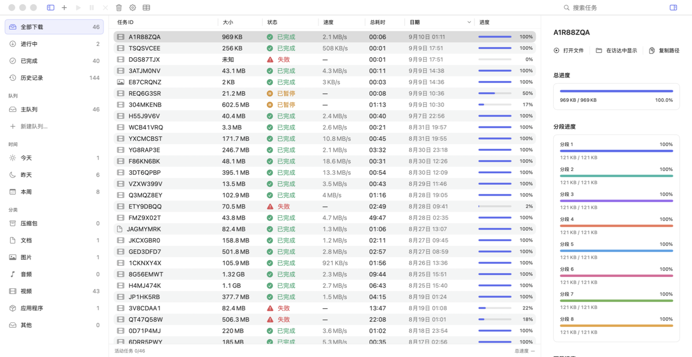
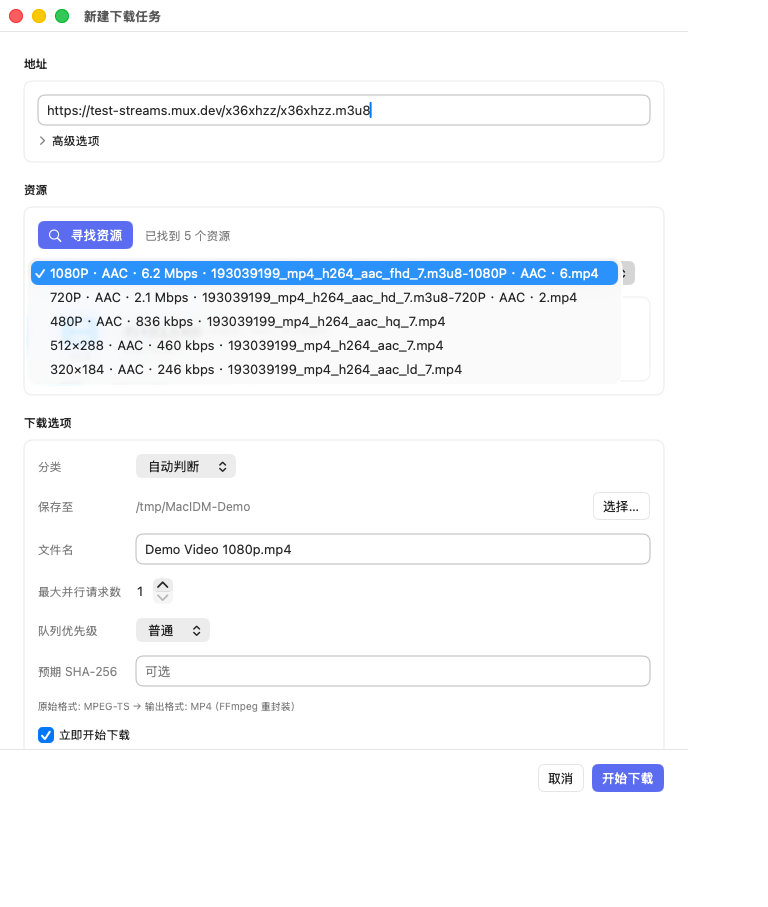
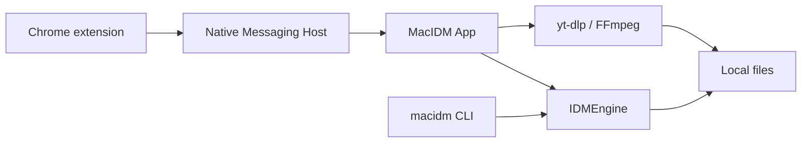

<div align="center">
  
  <h1>MacIDM</h1>
  <p>A macOS downloader written in Swift, with a Chrome extension for finding media.</p>
  <p><a href="README.md">简体中文</a> · <a href="https://github.com/Raters0/MacIDM/releases/tag/v1.0.0">Download v1.0.0</a> · <a href="#quick-start">Quick start</a></p>
</div>

I wanted to build an IDM-like general-purpose downloader for the Mac: a simple interface, modest memory use, and a way to save video and audio found on web pages. MacIDM is that project.

The app uses Swift and SwiftUI. My download engine handles ordinary files, segmented transfers, resume, and queues; the Chrome extension finds media on web pages. Most of the work has gone into download scheduling, media discovery, and memory usage, so those are the parts described below.

<table><tr><td></td></tr></table>

## What I've been working on

### Downloads and memory

Ordinary downloads support segmentation, pause and resume, queues, and rate limits. Parallel requests can be set from 1 to 64. Slow segments can be split again, and connection policy adjusts when a server returns 429 or 503. Range responses and resource identity are checked before segmented transfers and resume to avoid assembling an incorrect file.

Keeping memory use down has been a particular focus. HLS and DASH segments are written to disk as they arrive, with per-task and global buffer limits that adjust to the machine's memory. I haven't put a fixed MB figure here: usage also depends on the number of tasks and the resources being downloaded.

### Finding media on a page

Some media URLs appear directly in network requests; others are buried in player scripts or API responses. The extension observes network requests, fetch / XHR, response types and byte signatures, JSON, the DOM, and Performance entries, then normalizes and deduplicates the candidates.

Alongside finding resources, I've worked on reducing duplicates, small audio files and media fragments in the list, and keeping candidates up to date as pages change. Beyond collecting links, I wanted the resources found in the browser to be usable in the local download manager.

The on-page download button starts collapsed. Click it to see candidates, select a resource, then confirm the task in the app. Here's the floating panel opening and closing:

<table><tr><td></td></tr></table>

Demo video: [Sintel](https://www.sintel.org/), Blender Foundation.

The toolbar Popup also lists resources from the current page. “Download all links on this page” opens the whole-page link collection and filtering workflow.

<table><tr><td></td></tr></table>

### The app and a few extras

The main window contains the task list, filters, and download details, including segment progress and a speed graph. When adding a task, you can change the destination, filename, and concurrency. HLS / DASH sources with multiple quality options list them before downloading.

<table><tr><td></td></tr></table>

There are also proxy settings, global and per-task rate limits, Chinese and English interfaces, a CLI, and a local HTTP API. If you prefer a terminal or scripts, see the command-line section below.

## How it works



- **Ordinary files**: the engine probes Range support, validates segment responses, and writes at absolute offsets. It supports resume and optional SHA-256 verification.
- **HLS / static DASH**: downloads media segments, handles HLS AES-128 and byte ranges, and pairs DASH audio/video tracks. FFmpeg handles remuxing or merging when needed. Bilibili has dedicated adapter code.
- **YouTube and similar pages**: [yt-dlp](https://github.com/yt-dlp/yt-dlp) handles format extraction and downloads. When regular discovery finds no resource on other video sites, its generic extractor is also tried as a fallback. Thanks to the project and its contributors for all that site-support work.
- **Extension and app**: communicate through a Native Messaging Host and an authenticated local Unix socket. Page candidates are temporary; a download task is created after confirmation.

The engine, app, CLI, and bridge are separate Swift targets. Page observation, Popup UI, and shared data handling also live separately in the extension so they can be tested and changed independently.

## Quick start

### 1. Download v1.0.0

Go to [Release v1.0.0](https://github.com/Raters0/MacIDM/releases/tag/v1.0.0) and download:

- `MacIDM-v1.0.0-macos-development.app.zip`: the macOS app;
- `MacIDM-v1.0.0-chrome-extension.zip`: the Chrome extension;
- `SHA256SUMS.txt`: SHA-256 checksums for the files above — verify after downloading.

Unzip the app archive and put `MacIDM.app` in `~/Applications/`, the default location used by the Host registration script below. If you use `/Applications/`, prefix that script with `MACIDM_DEBUG_INSTALL_DIRECTORY=/Applications`.

### 2. Load the Chrome extension

1. Open `chrome://extensions` in Chrome;
2. Enable **Developer mode** (top right);
3. Click **Load unpacked** and select the extracted extension directory (the folder containing `manifest.json`);
4. Once loaded, the MacIDM icon appears in the toolbar.

### 3. Register the Native Messaging Host

The extension reaches the local app through a Native Messaging Host. From the extracted source repository, run:

```bash
bash scripts/install-debug-native-host.sh   # register the Host with installed Chromium-family browsers
bash scripts/check-debug-native-host.sh     # verify Host connectivity
```

The script points the Host manifest at the `macidm-host` inside the installed `MacIDM.app`. For custom Chromium profile directories, append paths with `MACIDM_NMH_EXTRA_DIRS`; for dynamically generated local extension IDs, append allowed origins with `MACIDM_NMH_ALLOWED_ORIGINS`.

### 4. Make your first download

- **Ordinary URL**: in the app, click **Add**, paste an HTTP(S) address, and choose a destination;
- **Web media**: open a page with audio/video (play it once if needed), click the MacIDM toolbar icon or the floating button near the media, pick a candidate in the Popup, then confirm name, destination, and concurrency in the app and click **Start download**;
- **Whole page**: use the context menu or the Download All page to scan, dedupe, filter, and batch-submit the page's links;
- **Task control**: pause, resume, and cancel from the list or detail pane; adjust global speed limits, simultaneous downloads, queues, and proxy in Settings.

## Usage guide

- **Confirmation window**: before downloading you can change the filename, destination, maximum parallel requests (1–64), and queue priority, and optionally supply an expected SHA-256 for integrity checking; HLS/DASH sources list quality variants first.
- **Queues and categories**: filter by status, queue, time, and category in the sidebar; set per-queue concurrency and completion actions.
- **Rate limiting and proxy**: Settings offers a global token-bucket speed limit and proxy configuration; proxy passwords are stored only in the system Keychain.
- **Logged-in resources**: for ordinary GET resources that need a session, the extension rebuilds request context only after you explicitly authorize cookies for the current site; POST, Authorization headers, complex custom headers, `blob:`, and DRM degrade safely.
- **Filename privacy**: enable filename redaction in Settings so the list and detail show task IDs instead of sensitive filenames.

## CLI and local Agent API

The CLI shares the download engine with the app and is well suited to scripting and automation:

```bash
swift build --product macidm
export PATH="$PWD/.build/debug:$PATH"

macidm add https://example.com/file.zip --output "$HOME/Downloads/file.zip" --parallel 8
macidm add https://example.com/file.zip --output /tmp/file.zip --sha256 <64-hex-digest> --foreground
macidm inspect https://example.com/watch --media-kind hls   # parse variants without downloading
macidm status
macidm status <task-id> --json
macidm pause <task-id>
macidm resume <task-id>
macidm cancel <task-id>
macidm watch --interval 1.0     # live TUI monitoring
macidm logs --follow --lines 50 # tail the app log
macidm app-status               # one-shot state snapshot
```

Global options: `--json` for machine-readable output; `--state-dir <path>` to override the CLI state directory (default `~/Library/Application Support/MacIDM/cli/`). Signed/query URLs are never persisted; use `--foreground` for one-process downloads.

**Local Agent API.** The app exposes a localhost-only HTTP API on `127.0.0.1:7831` so scripts and AI agents can read state and control tasks without screenshots or UI automation. Every endpoint except `/health` requires the per-launch `X-MacIDM-Token`. Full endpoints and security boundaries are in [docs/agent-http-api.md](docs/agent-http-api.md).

## Building from source

Requirements: macOS 13+; Swift 6 / Xcode Command Line Tools matching `Package.swift`; Node.js (extension unit tests); `ffmpeg` / `ffprobe` (HLS/DASH remux verification); a resolvable `yt-dlp` for the YouTube path (`scripts/fetch-ytdlp.sh` can prepare one; the release app ships it).

```bash
git clone https://github.com/Raters0/MacIDM.git
cd MacIDM

swift build                      # build all targets
swift build --product macidm     # build only the CLI
swift run macidm --help          # show CLI usage
bash scripts/build-debug-app.sh  # assemble a local MacIDM.app
```

Assemble, install, and register the Host:

```bash
bash scripts/install-debug-app.sh
bash scripts/install-debug-native-host.sh
bash scripts/check-debug-native-host.sh
open "$HOME/Applications/MacIDM.app"
```

The installer refuses to replace a running MacIDM; make sure no downloads are active, quit the old process, and retry.

## Testing

Common checks:

```bash
swift format lint --recursive --strict --configuration .swift-format Sources Tests Package.swift
swift test
swift build --product macidm
bash Tests/Integration/download-engine-integration.sh
bash Tests/Integration/hls-download-integration.sh
node --test Tests/BrowserExtensionTests/Unit/*.test.mjs
```

For media-related changes:

```bash
# FFmpeg / local media remux
bash Tests/Integration/ffmpeg-remux-integration.sh
bash Tests/Integration/app-media-pipeline-integration.sh

# YouTube / yt-dlp path (requires a resolvable yt-dlp; network failures are reported explicitly)
bash Tests/Integration/youtube-ytdlp-integration.sh

# DASH routing or engine foundations
swift test --filter 'DASHParserTests|DASHDownloadExecutorTests|Phase5FoundationTests'
```

## Repository layout

```text
Sources/
├── IDMEngine/          Reusable download engine: HTTP, HLS, DASH, FFmpeg validation
├── MacIDMApp/          SwiftUI app, task control plane, persistence, site services
├── MacIDMBridge/       Message protocol, validation, authenticated UDS, Native Messaging frames
├── MacIDMHost/         Chrome Native Messaging executable Host
└── MacIDMCLI/          CLI arguments, state, persistence, worker orchestration

BrowserExtension/chrome/  Chrome MV3 extension and production assets
Tests/                    Swift/Node unit tests, integration tests, fixtures, test servers
Resources/                App icons, menu-bar resources, localization
scripts/                  Build, install, Host registration, and test scripts
docs/agent-http-api.md    Local Agent HTTP API reference
```

## Privacy and local data

Downloads and task management run locally. Filenames can be hidden in Settings, and ordinary logs omit page titles, full URLs, and local paths. A separate local diagnostic log keeps more detail for troubleshooting. Cookies, Authorization headers, proxy passwords, and bridge tokens are not logged verbatim by default.

I also had AI-assisted debugging in mind: checking speed, retries, or task state usually doesn't require sharing the title or address of what's being downloaded. Start with the ordinary log, inspect detailed diagnostics for a specific task when needed, and check the contents before sharing.

## Acknowledgements and license

- Thanks to the [yt-dlp](https://github.com/yt-dlp/yt-dlp) project and its contributors for providing an essential foundation for site media parsing and video downloads;
- FFmpeg / ffprobe are used for media remuxing and verification, under their own licenses;
- Other third-party components remain subject to their own licenses.

This repository is released under the [MIT License](LICENSE).
