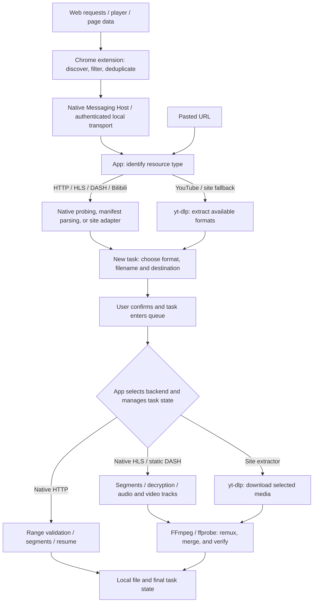

<div align="center">
  
  <h1>MacIDM</h1>
  <p>A macOS downloader written in Swift, with a Chrome extension for finding media.</p>
  <p><a href="README.md">简体中文</a> · <a href="https://github.com/Raters0/MacIDM/releases/tag/v1.0.0">Download v1.0.0</a> · <a href="#quick-start">Quick start</a></p>
</div>

MacIDM is a general-purpose macOS downloader written in Swift and SwiftUI. It supports browser media discovery, segmented downloads, resume, queues, and rate limits, with a simple interface and low memory usage as design goals. [Internet Download Manager (IDM)](https://www.internetdownloadmanager.com/) [has no macOS version](https://www.internetdownloadmanager.com/register/new_faq/functions2.html), so MacIDM was built to combine browser-side media discovery and native segmented downloading on the Mac. The Chrome extension finds files, video, and audio on web pages; the app handles resource inspection, download confirmation, and task management.

<p></p>

## Features

### Downloads and memory

Ordinary downloads support segmentation, pause and resume, queues, and rate limits. Parallel requests can be set from 1 to 64. Slow segments can be split again, and connection policy adjusts when a server returns 429 or 503. Range responses and resource identity are checked before segmented transfers and resume to avoid assembling an incorrect file.

HLS and DASH segments are streamed to disk as they arrive. Per-task and global buffer limits adjust to physical memory, avoiding the need to hold complete media files or large segments in memory.

### Finding media on a page

Some media URLs appear directly in network requests; others are buried in player scripts or API responses. The extension observes network requests, fetch / XHR, response types and byte signatures, JSON, the DOM, and Performance entries, then normalizes and deduplicates the candidates.

The extension reduces noise from duplicate candidates and small audio files, groups media fragments, and updates the list as pages change. Discovery and resource selection happen in the browser; the local app and its download backends execute the download.

The on-page download button starts collapsed. This walkthrough shows opening the panel, expanding a resource, clicking Download, and arriving at the app's new task window:

<p></p>

Demo video: [Sintel](https://www.sintel.org/), Blender Foundation.

The toolbar Popup also lists resources from the current page. “Download all links on this page” opens the whole-page link collection and filtering workflow.

<table><tr><td></td></tr></table>

### Task management and other features

The main window contains the task list, filters, and download details, including segment progress and a speed graph. When adding a task, you can change the destination, filename, and concurrency. HLS / DASH sources with multiple quality options list them before downloading.

There are also proxy settings, a global rate limit, Chinese and English interfaces, a CLI, and a local HTTP API. The command-line tools can read status, control tasks, and support automation scripts.

## How it works

A download goes through discovery, inspection and confirmation, then execution. A detected URL may point to a file, a media manifest, or a site page that needs further extraction.



**Resource inspection.** Ordinary files are probed for size and Range support; HLS / DASH manifests are parsed for available qualities; Bilibili uses dedicated adapter code. YouTube uses [yt-dlp](https://github.com/yt-dlp/yt-dlp) to extract formats. Its generic extractor is also tried when regular discovery finds no resource on other video sites.

**Task execution.** The app selects the download backend and manages queues, concurrency, pause, resume, and final task state. `IDMEngine` handles ordinary HTTP, HLS, and static DASH: it validates HTTP segment responses and writes at absolute offsets, supports HLS AES-128 and byte ranges, and handles separate DASH audio/video tracks. The site-extractor backend uses yt-dlp to download the selected media. HLS, DASH, and site media then use FFmpeg for remuxing or merging as needed and ffprobe for verification. Media buffers are bounded by per-task and global memory budgets.

**Local communication.** The extension communicates through a Native Messaging Host and the app's authenticated Unix socket. Candidates stay in memory until the user confirms a download task. The CLI uses the same download engine independently; the local HTTP API reads and controls tasks in the app.

## Quick start

### 1. Download v1.0.0

Go to [Release v1.0.0](https://github.com/Raters0/MacIDM/releases/tag/v1.0.0) and download:

- `MacIDM-v1.0.0-macos-development.app.zip`: the macOS app;
- `MacIDM-v1.0.0-chrome-extension.zip`: the Chrome extension;
- `SHA256SUMS.txt`: SHA-256 checksums for the files above — verify after downloading.

Unzip the app archive and put `MacIDM.app` in `~/Applications/`, the default location used by the Host registration script below. If you use `/Applications/`, prefix that script with `MACIDM_DEBUG_INSTALL_DIRECTORY=/Applications`.

### 2. Load the Chrome extension

1. Open `chrome://extensions` in Chrome;
2. Enable **Developer mode** (top right);
3. Click **Load unpacked** and select the extracted extension directory (the folder containing `manifest.json`);
4. Once loaded, the MacIDM icon appears in the toolbar.

### 3. Register the Native Messaging Host

The extension reaches the local app through a Native Messaging Host. From the extracted source repository, run:

```bash
bash scripts/install-debug-native-host.sh   # register the Host with installed Chromium-family browsers
bash scripts/check-debug-native-host.sh     # verify Host connectivity
```

The script points the Host manifest at the `macidm-host` inside the installed `MacIDM.app`. For custom Chromium profile directories, append paths with `MACIDM_NMH_EXTRA_DIRS`; for dynamically generated local extension IDs, append allowed origins with `MACIDM_NMH_ALLOWED_ORIGINS`.

### 4. Make your first download

- **Ordinary URL**: in the app, click **Add**, paste an HTTP(S) address, and choose a destination;
- **Web media**: open a page with audio/video (play it once if needed), click the MacIDM toolbar icon or the floating button near the media, pick a candidate in the Popup, then confirm name, destination, and concurrency in the app and click **Start download**;
- **Whole page**: use the context menu or the Download All page to scan, dedupe, filter, and batch-submit the page's links;
- **Task control**: pause, resume, and cancel from the list or detail pane; adjust global speed limits, simultaneous downloads, queues, and proxy in Settings.

## Usage guide

- **Confirmation window**: before downloading you can change the filename, destination, maximum parallel requests (1–64), and queue priority, and optionally supply an expected SHA-256 for integrity checking; HLS/DASH sources list quality variants first.
- **Queues and categories**: filter by status, queue, time, and category in the sidebar; set per-queue concurrency, ordering, and schedule windows.
- **Rate limiting and proxy**: Settings offers a global token-bucket speed limit and proxy configuration; proxy passwords are stored only in the system Keychain.
- **Logged-in resources**: for ordinary GET resources that need a session, the extension rebuilds request context only after you explicitly authorize cookies for the current site; POST, Authorization headers, complex custom headers, `blob:`, and DRM degrade safely.
- **Filename privacy**: enable filename redaction in Settings so the list and detail show job identifiers instead of filenames.

## CLI and local Agent API

The CLI uses the same download engine independently of the app and can be used for scripting and automation:

```bash
swift build --product macidm
export PATH="$PWD/.build/debug:$PATH"

macidm add https://example.com/file.zip --output "$HOME/Downloads/file.zip" --parallel 8
macidm add https://example.com/file.zip --output /tmp/file.zip --sha256 <64-hex-digest> --foreground
macidm inspect https://example.com/watch --media-kind hls   # parse variants without downloading
macidm status
macidm status <task-id> --json
macidm pause <task-id>
macidm resume <task-id>
macidm cancel <task-id>
macidm watch --interval 1.0     # live TUI monitoring
macidm logs --follow --lines 50 # tail the app log
macidm app-status               # one-shot state snapshot
```

Global options: `--json` for machine-readable output; `--state-dir <path>` to override the CLI state directory (default `~/Library/Application Support/MacIDM/cli/`). Signed/query URLs are never persisted; use `--foreground` for one-process downloads.

**Local Agent API.** The app exposes a localhost-only HTTP API on `127.0.0.1:7831` so scripts and AI agents can read state and control tasks without screenshots or UI automation. Every endpoint except `/health` requires the per-launch `X-MacIDM-Token`. Full endpoints and security boundaries are in [docs/agent-http-api.md](docs/agent-http-api.md).

## Building from source

Requirements: macOS 13+; Swift 6 / Xcode Command Line Tools matching `Package.swift`; Node.js (extension unit tests); `ffmpeg` / `ffprobe` (HLS/DASH remux verification); a resolvable `yt-dlp` for the YouTube path (`scripts/fetch-ytdlp.sh` can prepare one; the release app ships it).

```bash
git clone https://github.com/Raters0/MacIDM.git
cd MacIDM

swift build                      # build all targets
swift build --product macidm     # build only the CLI
swift run macidm --help          # show CLI usage
bash scripts/build-debug-app.sh  # assemble a local MacIDM.app
```

Assemble, install, and register the Host:

```bash
bash scripts/install-debug-app.sh
bash scripts/install-debug-native-host.sh
bash scripts/check-debug-native-host.sh
open "$HOME/Applications/MacIDM.app"
```

The installer refuses to replace a running MacIDM; make sure no downloads are active, quit the old process, and retry.

## Testing

Common checks:

```bash
swift format lint --recursive --strict --configuration .swift-format Sources Tests Package.swift
swift test
swift build --product macidm
bash Tests/Integration/download-engine-integration.sh
bash Tests/Integration/hls-download-integration.sh
node --test Tests/BrowserExtensionTests/Unit/*.test.mjs
```

For media-related changes:

```bash
# FFmpeg / local media remux
bash Tests/Integration/ffmpeg-remux-integration.sh
bash Tests/Integration/app-media-pipeline-integration.sh

# YouTube / yt-dlp path (requires a resolvable yt-dlp; network failures are reported explicitly)
bash Tests/Integration/youtube-ytdlp-integration.sh

# DASH routing or engine foundations
swift test --filter 'DASHParserTests|DASHDownloadExecutorTests|Phase5FoundationTests'
```

## Repository layout

```text
Sources/
├── IDMEngine/          Reusable download engine: HTTP, HLS, DASH, FFmpeg validation
├── MacIDMApp/          SwiftUI app, task control plane, persistence, site services
├── MacIDMBridge/       Message protocol, validation, authenticated UDS, Native Messaging frames
├── MacIDMHost/         Chrome Native Messaging executable Host
└── MacIDMCLI/          CLI arguments, state, persistence, worker orchestration

BrowserExtension/chrome/  Chrome MV3 extension and production assets
Tests/                    Swift/Node unit tests, integration tests, fixtures, test servers
Resources/                App icons, menu-bar resources, localization
scripts/                  Build, install, Host registration, and test scripts
docs/agent-http-api.md    Local Agent HTTP API reference
```

## Privacy and local data

Downloads and task management run locally. Filenames can be hidden in Settings, and ordinary logs omit page titles, full URLs, and local paths. A separate local diagnostic log keeps more detail for troubleshooting. Cookies, Authorization headers, proxy passwords, and bridge tokens are not logged verbatim by default.

For AI-assisted debugging, checking speed, retries, or task state usually doesn't require sharing the title or address of what's being downloaded. Start with the ordinary log, inspect detailed diagnostics for a specific task when needed, and check the contents before sharing.

## Acknowledgements and license

- [yt-dlp](https://github.com/yt-dlp/yt-dlp) provides site media extraction and download support;
- FFmpeg / ffprobe are used for media remuxing and verification, under their own licenses;
- Other third-party components remain subject to their own licenses.

This repository is released under the [MIT License](LICENSE).
