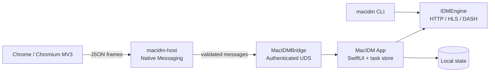

<div align="center">
  
  <h1>MacIDM</h1>
  <p><a href="README.md">简体中文</a></p>
  <p><strong>Local-first macOS download manager · Chrome media discovery and download bridge</strong></p>
  <p>A Swift-based desktop download app, command-line tool, Native Messaging Host, and Chrome MV3 extension.</p>
  <p><em>A local-first macOS download manager with a Chrome MV3 extension for media discovery — built in Swift, featuring a download engine, desktop app, CLI, and Native Messaging Host.</em></p>
  <p>
    
    
    
    
  </p>
</div>

> MacIDM is currently a local developer preview for macOS. It includes the download engine, desktop task management, browser handoff, and controlled media-download paths. The current build is not a Developer ID-signed, notarized, or App Store release.

## Contents

- [Project scope](#project-scope)
- [Capabilities](#capabilities)
- [Architecture](#architecture)
- [Quick start](#quick-start)
- [Usage](#usage)
- [Build and release](#build-and-release)
- [Testing and verification](#testing-and-verification)
- [Repository layout](#repository-layout)
- [Privacy and security boundaries](#privacy-and-security-boundaries)
- [Current limitations](#current-limitations)
- [Documentation and license](#documentation-and-license)

## Project scope

MacIDM is first a download manager, and only then a video or web-media tool. It combines a verifiable HTTP download core, a native macOS task interface, browser entry points, and authenticated local communication:

- ordinary file downloads use validated Range probing, segmented transfer, resumable checkpoints, and atomic publication;
- the macOS app owns task confirmation, queueing, pause/resume, proxy settings, persistence, and completion actions;
- the Chrome extension discovers page media and hands off user-submitted browser downloads while leaving the final decision to the app;
- HLS, static DASH, Bilibili, and yt-dlp routes are enabled only when their safety and toolchain conditions are met;
- candidate discovery never silently creates a task and never starts a download merely because the user opened an HTTP(S) page.

## Capabilities

| Module | Current coverage | Notes |
| --- | --- | --- |
| Download engine | HTTP segmentation, Range validation, strong ETags, resume, retry, SHA-256, absolute-offset writes | Segmented transfer is enabled only after response validation; existing final files are not overwritten |
| macOS app | SwiftUI two-column UI, task list, search, category filters, queue, proxy, completion actions, bilingual UI | The Debug app installs to `~/Applications/MacIDM.app` |
| Media paths | HLS VOD, static DASH, controlled FFmpeg/ffprobe validation, Bilibili, yt-dlp | DRM, live MPD, and unverified site coverage are outside the current promise |
| Chrome extension | MV3 Popup, media candidate discovery, collapsed floating panel, Download All, download takeover | Currently targeted at local Chrome/Chromium developer-mode testing |
| Local bridge | Native Messaging + authenticated UDS + strict JSON protocol | The extension does not access the app's internal task store directly |
| CLI | `add`, `status`, `pause`, `resume`, `cancel`, JSON output | Shares core models with the engine and does not depend on the UI |
| Automation API | Localhost Agent HTTP API, state snapshots, CLI status reads | See [`docs/agent-http-api.md`](docs/agent-http-api.md) |

## Architecture



The layers are separated by long-term responsibility: the engine does not depend on the UI, the bridge owns protocol and transport validation, the Host only forwards Native Messaging traffic, and page discovery remains separate from Popup presentation.

## Quick start

### Requirements

- macOS 13 or later;
- Swift 6 / Xcode Command Line Tools compatible with `Package.swift`;
- Node.js for Chrome extension unit tests;
- `ffmpeg` and `ffprobe` for HLS/DASH remux verification;
- an available `yt-dlp` binary for the YouTube/site-extraction path. The repository includes a script that can prepare one.

### Clone and run the basic checks

```bash
git clone <repository-url> MacIDM
cd MacIDM

swift build
swift test
node --test Tests/BrowserExtensionTests/Unit/*.test.mjs
```

If multiple Xcode or SDK installations are present, make sure `xcode-select` points to a toolchain compatible with the active Swift compiler.

### Build and install the local Debug app

The installation script creates and validates the stable `MacIDM.app` bundle and installs it in the user's Applications directory. It does not leave the transient `.build/debug/MacIDM.app` as a second launchable copy.

```bash
bash scripts/install-debug-app.sh
bash scripts/install-debug-native-host.sh
bash scripts/check-debug-native-host.sh
open "$HOME/Applications/MacIDM.app"
```

The script refuses to replace the app while MacIDM is running. Make sure there are no active downloads before quitting the old process and retrying.

### Load the Chrome extension

1. Open `chrome://extensions` in Chrome.
2. Enable **Developer mode**.
3. Choose **Load unpacked** and select `BrowserExtension/chrome/` from the repository.
4. After changing extension code, click **Reload** and refresh pages that are under test.

The Native Host installer points the manifest at `~/Applications/MacIDM.app/Contents/MacOS/macidm-host`. For custom Chromium profiles, append directories with `MACIDM_NMH_EXTRA_DIRS`. For dynamically generated local extension IDs, append allowed origins with `MACIDM_NMH_ALLOWED_ORIGINS`.

## Usage

### Add a task in the app

Click **Add**, enter an HTTP(S) URL, and choose a destination. For page URLs, **Find resources** reads only a bounded set of media candidates from public HTML. When multiple HLS/DASH variants are found, choose a variant and confirm the filename and destination. Resource inspection does not create a task.

### Discover media from Chrome

After the extension enters an ordinary HTTP(S) page, candidates are collected in short-lived memory; no download starts automatically:

1. Open a page containing audio or video and play the media once if needed.
2. Click the MacIDM toolbar icon to view Popup candidates, or click the collapsed floating button near the media element.
3. Choose a direct URL or an HLS/DASH/site variant.
4. Adjust the destination, filename, and concurrency in the MacIDM confirmation window.
5. Click **Start download** or **Add to list**.

For ordinary GET resources that require a login session, the extension attempts to rebuild request context only after the user explicitly authorizes cookies for the current site. POST requests, Authorization headers, complex custom headers, `blob:` URLs, DRM, and one-time page state that cannot be safely restored are downgraded safely.

### Download all links on the page

Use the context menu or the Download All page to scan, deduplicate, filter, and select page links for batch submission. Results stay in short-lived service-worker memory and are cleared after expiry; no task is created before user confirmation.

### CLI

```bash
# Build the CLI
swift build --product macidm

# Create a task in the background
.build/debug/macidm add https://example.com/file.zip \
  --output "$HOME/Downloads/file.zip" \
  --parallel 8

# Run in the foreground and verify SHA-256
.build/debug/macidm add https://example.com/file.zip \
  --output /tmp/file.zip \
  --parallel 8 \
  --sha256 <64-hex-digit-digest> \
  --foreground

.build/debug/macidm status
.build/debug/macidm status <task-id> --json
.build/debug/macidm pause <task-id>
.build/debug/macidm resume <task-id>
.build/debug/macidm cancel <task-id>
```

The CLI stores state in `~/Library/Application Support/MacIDM/cli/` by default. Use `--state-dir <path>` for tests or isolated runs.

## Build and release

### Local build

```bash
swift build
swift build --product macidm
bash scripts/build-debug-app.sh
```

`build-debug-app.sh` creates a local development bundle and uses an ad-hoc signature so macOS can launch it on the development machine. It is not a Developer ID distribution package, is not notarized, and does not create a `.dmg`. FFmpeg is never downloaded or presented as available silently by this script; media tasks report toolchain success or failure explicitly.

### GitHub Release guidance

The source repository should contain source code, required assets, tests, and reproducible scripts. Upload the built `.app`, extension archive, and other large files as GitHub Release assets instead of committing them to source history. Each release should state:

- version, source commit, and build date;
- whether the app is ad-hoc, Developer ID signed, or notarized;
- sources, versions, licenses, and checksums for third-party tools such as `yt-dlp` and FFmpeg;
- the extension installation method, permission scope, and supported browsers;
- whether post-install launch, extension reload, page refresh, and real-file decode/playback checks were completed.

The repository currently provides local Debug assembly scripts only. Do not describe a local development artifact as a formal release.

## Testing and verification

`Tests/` contains reproducible tests directly related to the app, engine, bridge protocol, and extension. It is separate from screenshots, AI review records, and download caches.

### Basic gates

```bash
swift format lint --recursive --strict --configuration .swift-format Sources Tests Package.swift
swift test
swift build --product macidm
bash Tests/Integration/download-engine-integration.sh
bash Tests/Integration/hls-download-integration.sh
node --test Tests/BrowserExtensionTests/Unit/*.test.mjs
```

### Additional gates by change scope

```bash
# FFmpeg / local media remux
bash Tests/Integration/ffmpeg-remux-integration.sh
bash Tests/Integration/app-media-pipeline-integration.sh

# YouTube / yt-dlp path (requires a resolvable yt-dlp; network failures are reported explicitly)
bash Tests/Integration/youtube-ytdlp-integration.sh

# DASH routing or Phase 5 engine foundations
swift test --filter 'DASHParserTests|DASHDownloadExecutorTests|Phase5FoundationTests'
```

Passing automated tests does not prove that a real website, installed app, Chrome Popup, or visual layout has been accepted. For those paths, record the installed bundle identity, extension reload, page refresh, task ID, final file, and `ffprobe`/full-decode evidence separately.

## Repository layout

```text
Sources/
├── IDMEngine/          Reusable download engine, HTTP, HLS, DASH, FFmpeg validation
├── MacIDMApp/          SwiftUI app, task control plane, persistence, and site services
├── MacIDMBridge/       Message protocol, validation, authenticated UDS, Native Messaging frames
├── MacIDMHost/         Chrome Native Messaging executable Host
└── MacIDMCLI/          CLI arguments, state, persistence, and worker orchestration

BrowserExtension/chrome/  Chrome MV3 extension and production assets
Tests/                    Swift/Node unit tests, integration tests, fixtures, and test servers
Resources/                App icons, menu-bar resources, and localization
scripts/                  Build, installation, Host registration, and test scripts
docs/agent-http-api.md    Local Agent HTTP API reference
```

## Privacy and security boundaries

- There is no cloud download service; core downloading and bridging run locally.
- Page-media candidates normally stay in short-lived extension memory; discovery never downloads automatically.
- Cookies are used for controlled ordinary GET requests only after explicit site authorization. Cookies, Authorization headers, bridge tokens, and proxy passwords must not enter ordinary logs or task persistence.
- Ordinary logs use redacted URLs, paths, and titles. The private diagnostic log is for local Debug troubleshooting and should not be added to Git, screenshots, issues, or ordinary support bundles.
- The Native Messaging Host and app use strict message validation and authenticated local transport. The localhost Agent HTTP API also requires a startup token, except for `/health`.
- Confirm that you have the right to save and use requested content, and follow the terms and laws applicable to the target site and your location.

## Current limitations

- Chrome/Chromium developer mode is the current integration target. Firefox, Safari, and official extension-store distribution have not completed compatibility and release acceptance.
- DRM, live MPD, complex POST/Authorization requests, `blob:` URLs, and some resources generated by page scripts cannot be guaranteed to download.
- HLS/DASH/yt-dlp site coverage changes with site protocols, login state, and third-party tools. Fixtures and local integration tests do not mean every public website is supported.
- The current app build is a local ad-hoc Debug build. Developer ID, Hardened Runtime, notarization, installers, and automatic updates are outside the current repository scope.
- If a single-stream resource cannot safely use segmented checkpoints, resume may restart from the beginning. Existing final files are not silently overwritten.

## Documentation and license

- [Local Agent HTTP API](docs/agent-http-api.md)
- [GitHub Actions CI](.github/workflows/ci.yml)

This repository is released under the [MIT License](LICENSE). Third-party tools such as `yt-dlp` and FFmpeg are supplied by the user's environment and remain subject to their own licenses; they are not redistributed by this repository.
