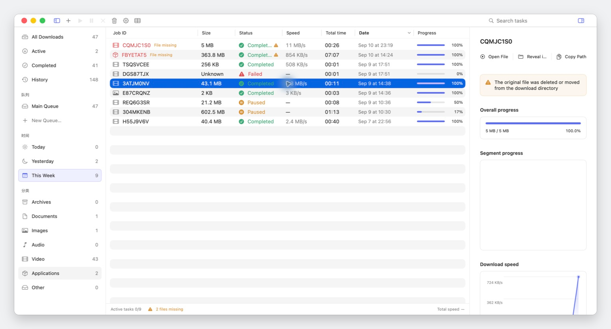
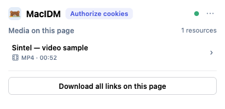
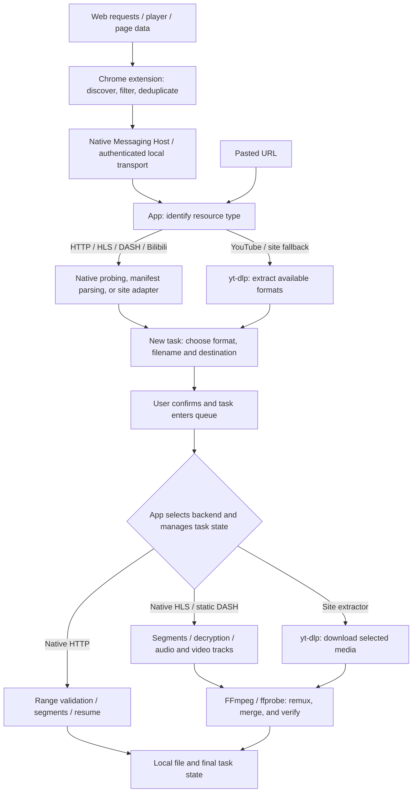

<div align="center">
  
  <h1>MacIDM</h1>
  <p>A native macOS media downloader written in Swift, designed around streamed I/O and bounded memory use, with a Chrome extension for media sniffing.</p>
  <p><a href="README.zh-CN.md">简体中文</a> · <a href="https://github.com/Raters0/MacIDM/releases">Download</a> · <a href="#quick-start">Quick start</a></p>
</div>

MacIDM is a macOS media downloader written in Swift / SwiftUI, with browser media sniffing, segmented downloads, resume, and more. [Internet Download Manager (IDM)](https://www.internetdownloadmanager.com/) still [has no macOS version](https://www.internetdownloadmanager.com/register/new_faq/functions2.html), so this project was created as a Chrome extension plus an App.

<p></p>

## Features

### Web media sniffing

1. The browser extension discovers and selects resources; downloads run in the local App and its download backends. You can also paste a download link directly in the App.

The walkthrough below shows clicking the floating button on a video / audio resource, expanding the resource, clicking Download, and opening the App's new-task window:

<p></p>

2. The toolbar Popup lists all media resources on the current page.

<table><tr><td></td></tr></table>

### Task management and other features

- The App main window provides the task list, categories, and download details, including segment progress and a speed graph.
- When creating a task you can change the save location, filename, and concurrency; HLS / DASH sources with multiple qualities list them first for selection.
- Proxy, global rate limiting, Chinese and English interfaces, CLI, and a local HTTP API are also supported. The CLI can read status, control tasks, and support automation scripts.
- Filename hiding is supported, to avoid triggering AI Agent sensitive-word checks.
- Logs are stored by level; when using AI-assisted debugging, this reduces exposure of sensitive information (such as cookies) to third parties.

### Mainstream sites with dedicated optimizations

- [Bilibili](https://www.bilibili.com/)
- [YouTube](https://www.youtube.com/)
- [Douyin](https://www.douyin.com/)
- [X / Twitter](https://www.x.com/)

### Planned updates

- More AI Agent support, such as MCP and AI resource parsing.
- Sniffing optimizations for more sites.

## How it works

A download goes through discovery, inspection and confirmation, then execution. A detected URL may point to a file, a media manifest, or a site page that needs further extraction.



**Resource inspection.** Ordinary files are probed for size and Range support; HLS / DASH manifests are parsed for available qualities; Bilibili uses dedicated adapter code. YouTube uses [yt-dlp](https://github.com/yt-dlp/yt-dlp) to extract formats. Its generic extractor is also tried when regular discovery finds no resource on other video sites.

**Task execution.** The app selects the download backend and manages queues, concurrency, pause, resume, and final task state. `IDMEngine` handles ordinary HTTP, HLS, and static DASH: it validates HTTP segment responses and writes at absolute offsets, supports HLS AES-128 and byte ranges, and handles separate DASH audio/video tracks. The site-extractor backend uses yt-dlp to download the selected media. HLS, DASH, and site media then use FFmpeg for remuxing or merging as needed and ffprobe for verification. Media buffers are bounded by per-task and global memory budgets.

**Local communication.** The extension communicates through a Native Messaging Host and the app's authenticated Unix socket. Candidates stay in memory until the user confirms a download task. The CLI uses the same download engine independently; the local HTTP API reads and controls tasks in the app.

## Quick start

### 1. Download

Go to [Release](https://github.com/Raters0/MacIDM/releases) and download:

- `MacIDM-*-macos-development.app.zip`: the macOS App;
- `MacIDM-*-chrome-extension.zip`: the Chrome extension;
- `SHA256SUMS.txt`: SHA-256 checksums for the files above — verify after downloading.

Unzip the App archive and put `MacIDM.app` in `~/Applications/`. The Host registration script below uses this location by default; if you put it in `/Applications/`, prefix that script with `MACIDM_DEBUG_INSTALL_DIRECTORY=/Applications`.

### 2. Load the Chrome extension

1. Open `chrome://extensions` in Chrome;
2. Enable **Developer mode** (top right);
3. Click **Load unpacked** and select the extracted extension directory (the folder containing `manifest.json`);
4. Once loaded, the MacIDM icon appears in the toolbar.

### 3. Register the Native Messaging Host

The extension reaches the local App through a Native Messaging Host. From the extracted source repository, run:

```bash
bash scripts/install-debug-native-host.sh   # register the Host with installed Chromium-family browsers
bash scripts/check-debug-native-host.sh     # verify Host connectivity
```

The script points the Host manifest at the `macidm-host` inside the installed `MacIDM.app`. For custom Chromium profile directories, append paths with `MACIDM_NMH_EXTRA_DIRS`; for dynamically generated local extension IDs, append allowed origins with `MACIDM_NMH_ALLOWED_ORIGINS`.

## Usage guide

- **Confirmation window**: before downloading you can change the filename, destination, maximum parallel requests (1–64), and queue priority, and optionally supply an expected SHA-256 for integrity checking; HLS / DASH sources list quality variants first.
- **Queues and categories**: filter by status, queue, time, and category in the sidebar; set per-queue concurrency, ordering, and schedule windows.
- **Rate limiting and proxy**: Settings offers a global token-bucket speed limit and proxy configuration; proxy passwords are stored only in the system Keychain.
- **Logged-in resources**: for ordinary GET resources that need a session, the extension rebuilds request context only after you explicitly authorize cookies for the current site; POST, Authorization headers, complex custom headers, `blob:`, and DRM degrade safely.
- **Filename privacy**: enable filename redaction in Settings so the list and detail show job identifiers instead of filenames.

## CLI and local Agent API

The CLI uses the same download engine independently of the App and can be used for scripting and automation:

```bash
swift build --product macidm
export PATH="$PWD/.build/debug:$PATH"

macidm add https://example.com/file.zip --output "$HOME/Downloads/file.zip" --parallel 8
macidm add https://example.com/file.zip --output /tmp/file.zip --sha256 <64-hex-digest> --foreground
macidm inspect https://example.com/watch --media-kind hls   # parse variants without downloading
macidm status
macidm status <task-id> --json
macidm pause <task-id>
macidm resume <task-id>
macidm cancel <task-id>
macidm watch --interval 1.0     # live TUI monitoring
macidm logs --follow --lines 50 # tail the App log
macidm app-status               # one-shot state snapshot
```

Global options: `--json` for machine-readable output; `--state-dir <path>` to override the CLI state directory (default `~/Library/Application Support/MacIDM/cli/`). Signed/query URLs are never persisted; use `--foreground` for one-process downloads.

**Local Agent API.** The App exposes a localhost-only HTTP API on `127.0.0.1:7831` so scripts and AI agents can read state and control tasks without screenshots or UI automation. Every endpoint except `/health` requires the per-launch `X-MacIDM-Token`. Full endpoints and security boundaries are in [docs/agent-http-api.md](docs/agent-http-api.md).

## Building from source

Requirements: macOS 13+; Swift 6 / Xcode Command Line Tools matching `Package.swift`; Node.js (extension unit tests); `ffmpeg` / `ffprobe` (HLS / DASH remux verification); a resolvable `yt-dlp` for the YouTube path (`scripts/fetch-ytdlp.sh` can prepare one; the release App already bundles it).

```bash
git clone https://github.com/Raters0/MacIDM.git
cd MacIDM

swift build                      # build all targets
swift build --product macidm     # build only the CLI
swift run macidm --help          # show CLI usage
bash scripts/build-debug-app.sh  # assemble a local MacIDM.app
```

Assemble, install, and register the Host:

```bash
bash scripts/install-debug-app.sh
bash scripts/install-debug-native-host.sh
bash scripts/check-debug-native-host.sh
open "$HOME/Applications/MacIDM.app"
```

The installer refuses to replace a running MacIDM; make sure no downloads are active, quit the old process, and retry.

## Testing

Common checks:

```bash
swift format lint --recursive --strict --configuration .swift-format Sources Tests Package.swift
swift test
swift build --product macidm
bash Tests/Integration/download-engine-integration.sh
bash Tests/Integration/hls-download-integration.sh
node --test Tests/BrowserExtensionTests/Unit/*.test.mjs
```

Append checks based on the scope of changes:

```bash
# FFmpeg / local media remux
bash Tests/Integration/ffmpeg-remux-integration.sh
bash Tests/Integration/app-media-pipeline-integration.sh

# YouTube / yt-dlp path (requires a resolvable yt-dlp; network failures are reported explicitly)
bash Tests/Integration/youtube-ytdlp-integration.sh

# DASH routing or engine foundations
swift test --filter 'DASHParserTests|DASHDownloadExecutorTests|Phase5FoundationTests'
```

## Repository layout

```text
Sources/
├── IDMEngine/          Reusable download engine: HTTP, HLS, DASH, FFmpeg validation
├── MacIDMApp/          SwiftUI App, task control plane, persistence, site services
├── MacIDMBridge/       Message protocol, validation, authenticated UDS, Native Messaging frames
├── MacIDMHost/         Chrome Native Messaging executable Host
└── MacIDMCLI/          CLI arguments, state, persistence, worker orchestration

BrowserExtension/chrome/  Chrome MV3 extension and production assets
Tests/                    Swift/Node unit tests, integration tests, fixtures, test servers
Resources/                App icons, menu-bar resources, localization
scripts/                  Build, install, Host registration, and test scripts
docs/agent-http-api.md    Local Agent HTTP API reference
```

## Privacy and local data

Downloads and task management run locally. Filenames can be hidden in Settings, and ordinary logs omit page titles, full URLs, and local paths. A separate local diagnostic log keeps more detail for troubleshooting. Cookies, Authorization headers, proxy passwords, and bridge tokens are not logged verbatim by default.

For AI-assisted debugging, checking speed, retries, or task state usually doesn't require sharing the title or address of what's being downloaded. Start with the ordinary log, inspect detailed diagnostics for a specific task when needed, and check the contents before sharing.

## Acknowledgements and license

- [yt-dlp](https://github.com/yt-dlp/yt-dlp) provides site media extraction and download support;
- FFmpeg / ffprobe are used for media remuxing and verification, under their own licenses;
- Other third-party components remain subject to their own licenses.

This repository is released under the [MIT License](LICENSE).
