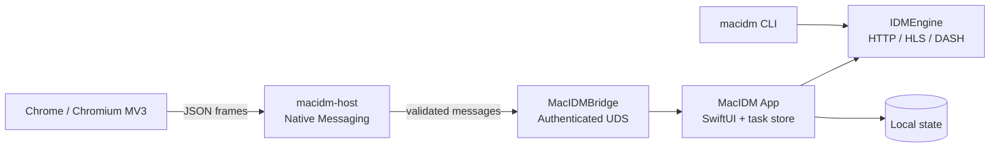

<div align="center">
  
  <h1>MacIDM</h1>
  <p><a href="README.en.md">English</a></p>
  <p><strong>macOS 本地优先下载管理器 · Chrome 媒体发现与下载桥</strong></p>
  <p>用 Swift 构建的桌面下载应用、命令行工具、Native Messaging Host 与 Chrome MV3 扩展。</p>
  <p><em>A local-first macOS download manager with a Chrome MV3 extension for media discovery — built in Swift, featuring a download engine, desktop app, CLI, and Native Messaging host.</em></p>
  <p>
    
    
    
    
  </p>
</div>

> MacIDM 当前是面向 macOS 的本地开发预览版。它已经覆盖下载引擎、桌面任务管理、浏览器接管和受控媒体下载链路，但还不是经过 Developer ID 签名、公证或商店审核的正式发行版。

## 目录

- [项目定位](#项目定位)
- [能力概览](#能力概览)
- [架构](#架构)
- [快速开始](#快速开始)
- [使用方式](#使用方式)
- [构建与发布](#构建与发布)
- [测试与验证](#测试与验证)
- [目录结构](#目录结构)
- [隐私与安全边界](#隐私与安全边界)
- [当前限制](#当前限制)
- [文档与许可证](#文档与许可证)

## 项目定位

MacIDM 首先是一个下载管理器，其次才是视频或网页媒体工具。项目把可靠的 HTTP 下载内核、macOS 原生任务界面、浏览器入口和本地安全通信组合在一起：

- 普通文件下载使用可验证的 Range 探测、分段并发、断点续传和原子发布；
- macOS App 负责任务确认、队列、暂停/恢复、代理、持久化和完成动作；
- Chrome 扩展负责发现网页媒体、接管用户主动提交的浏览器下载，并把最终决定交给 App；
- HLS、静态 DASH、Bilibili 和 yt-dlp 路径只在满足各自安全与工具链条件时启用；
- 候选发现不会静默创建任务，也不会因为用户打开一个 HTTP(S) 页面就自动下载。

## 能力概览

| 模块 | 当前代码覆盖 | 说明 |
| --- | --- | --- |
| 下载引擎 | HTTP 分段、Range 校验、强 ETag、续传、重试、SHA-256、绝对偏移写入 | 只有经过响应验证的资源才会进入分段路径；不覆盖已有最终文件 |
| macOS App | SwiftUI 双栏界面、任务列表、搜索、分类筛选、队列、代理、完成动作、双语 | Debug App 安装到 `~/Applications/MacIDM.app` |
| 媒体链路 | HLS VOD、静态 DASH、受控 FFmpeg/ffprobe 校验、Bilibili、yt-dlp | DRM、直播 MPD 和未验证的站点覆盖不在当前承诺内 |
| Chrome 扩展 | MV3 Popup、媒体候选发现、折叠悬浮面板、Download All、下载接管 | 当前按开发者模式加载，目标是 Chrome/Chromium 本地联调 |
| 本地桥接 | Native Messaging + 鉴权 UDS + 严格 JSON 协议 | 扩展不直接访问 App 的内部任务存储 |
| CLI | `add`、`status`、`pause`、`resume`、`cancel`、JSON 输出 | 与引擎共享核心模型，不依赖 UI |
| 自动化接口 | localhost Agent HTTP API、状态快照、CLI 状态读取 | 详见 [`docs/agent-http-api.md`](docs/agent-http-api.md) |

## 架构



各层按长期职责分离：引擎不依赖 UI，桥接层只负责协议与传输，Host 只做 Native Messaging 转发，扩展侧的页面发现与 Popup 展示保持独立。

## 快速开始

### 环境要求

- macOS 13 或更高版本；
- 与仓库 `Package.swift` 匹配的 Swift 6 / Xcode Command Line Tools；
- Node.js（运行 Chrome 扩展单元测试）；
- HLS/DASH remux 验证需要 `ffmpeg` 与 `ffprobe`；
- YouTube/站点提取路径可使用仓库构建脚本尝试准备 `yt-dlp`，也可以使用本机可解析的版本。

### 获取源码并运行基础检查

```bash
git clone <repository-url> MacIDM
cd MacIDM

swift build
swift test
node --test Tests/BrowserExtensionTests/Unit/*.test.mjs
```

如果本机安装了多个 Xcode 或 SDK，请先确认 `xcode-select` 指向与 Swift 编译器匹配的工具链。

### 构建并安装本地 Debug App

安装脚本会生成并验证稳定的 `MacIDM.app`，然后安装到用户应用程序目录；它不会把临时 `.build/debug/MacIDM.app` 留作第二个可启动副本。

```bash
bash scripts/install-debug-app.sh
bash scripts/install-debug-native-host.sh
bash scripts/check-debug-native-host.sh
open "$HOME/Applications/MacIDM.app"
```

注意：如果 `MacIDM` 正在运行，安装脚本会拒绝覆盖。请先确认没有活动下载，再退出旧进程并重试。

### 加载 Chrome 扩展

1. 打开 Chrome 的 `chrome://extensions`；
2. 开启“开发者模式”；
3. 选择“加载已解压的扩展程序”，指向仓库中的 `BrowserExtension/chrome/`；
4. 修改扩展源码后点击“重新加载”，再刷新正在测试的网页。

Native Host 安装脚本会把清单指向 `~/Applications/MacIDM.app/Contents/MacOS/macidm-host`。如果使用自定义 Chromium 配置目录，可通过 `MACIDM_NMH_EXTRA_DIRS` 追加目录；如果使用动态生成的本地扩展 ID，可通过 `MACIDM_NMH_ALLOWED_ORIGINS` 追加允许来源。

## 使用方式

### App 内直接添加

点击“添加”，输入 HTTP(S) 地址并选择保存目录。对于页面地址，点击“寻找资源”只会读取公开 HTML 中的有限媒体候选；发现多个 HLS/DASH 变体时，先选择画质，再确认文件名和保存位置。寻找阶段不会创建任务。

### Chrome 媒体发现

扩展进入普通 HTTP(S) 页面后会在内存中收集候选，不会自动下载：

1. 打开包含音视频的网页，按需播放一次媒体；
2. 点击工具栏中的 MacIDM 图标查看 Popup 候选，或点击媒体附近的折叠悬浮按钮；
3. 选择直链或 HLS/DASH/站点变体；
4. 在 MacIDM 确认窗口中调整目录、文件名和并发数；
5. 点击“开始下载”或“加入列表”。

需要登录态的普通 GET 资源，只有在用户明确授权当前站点 Cookie 后才会尝试重建请求上下文。POST、Authorization、自定义复杂请求头、`blob:`、DRM 和无法安全恢复的一次性页面状态会安全降级。

### 下载本页全部链接

右键菜单或 Download All 页面可扫描当前页链接，进行去重、筛选和勾选后批量提交。扫描结果仅保存于扩展 service worker 的短期内存，并在过期后清理；用户确认前不会创建下载任务。

### CLI

```bash
# 构建 CLI
swift build --product macidm

# 后台创建任务
.build/debug/macidm add https://example.com/file.zip \
  --output "$HOME/Downloads/file.zip" \
  --parallel 8

# 前台运行并校验 SHA-256
.build/debug/macidm add https://example.com/file.zip \
  --output /tmp/file.zip \
  --parallel 8 \
  --sha256 <64位十六进制摘要> \
  --foreground

.build/debug/macidm status
.build/debug/macidm status <task-id> --json
.build/debug/macidm pause <task-id>
.build/debug/macidm resume <task-id>
.build/debug/macidm cancel <task-id>
```

CLI 默认将状态写入 `~/Library/Application Support/MacIDM/cli/`；测试或隔离运行时可使用 `--state-dir <path>`。

## 构建与发布

### 本地构建

```bash
swift build
swift build --product macidm
bash scripts/build-debug-app.sh
```

`build-debug-app.sh` 生成的是本地开发 bundle，并进行 ad-hoc 签名以便 macOS 本机启动；它不是 Developer ID 发布包，不包含公证，也不会制作 `.dmg`。FFmpeg 不会因为这个脚本而被静默下载或伪装成可用工具，媒体任务会根据工具链校验结果明确成功或失败。

### GitHub Release 建议

源码仓库只保留源码、必要资源、测试和可复现脚本；构建好的 `.app`、扩展压缩包和其他大文件应作为 GitHub Release asset 上传，而不是提交到源码历史。发布前应明确：

- 版本号、构建提交和构建时间；
- App 是否为 ad-hoc、Developer ID 或已公证版本；
- `yt-dlp`、FFmpeg 等第三方工具的来源、版本、许可证和校验值；
- 浏览器扩展的加载方式、权限范围和当前支持浏览器；
- 是否已经完成安装后启动、扩展重载、页面刷新和真实文件解码/播放验证。

当前仓库只提供本地 Debug 组装脚本，因此不要把本地产物描述为正式发行版。

## 测试与验证

仓库中的 `Tests/` 是与 App、引擎、桥接协议和扩展直接相关的可复现测试代码，不等同于本机截图、AI 审计记录或下载缓存。

### 基础门禁

```bash
swift format lint --recursive --strict --configuration .swift-format Sources Tests Package.swift
swift test
swift build --product macidm
bash Tests/Integration/download-engine-integration.sh
bash Tests/Integration/hls-download-integration.sh
node --test Tests/BrowserExtensionTests/Unit/*.test.mjs
```

### 按变更范围追加

```bash
# FFmpeg/本地媒体 remux
bash Tests/Integration/ffmpeg-remux-integration.sh
bash Tests/Integration/app-media-pipeline-integration.sh

# YouTube / yt-dlp 路径（需要可解析的 yt-dlp；网络失败会被明确报告）
bash Tests/Integration/youtube-ytdlp-integration.sh

# DASH 路由或 Phase 5 引擎基础变更
swift test --filter 'DASHParserTests|DASHDownloadExecutorTests|Phase5FoundationTests'
```

自动化测试通过不等于真实网站、已安装 App、Chrome Popup 或视觉布局已经验收。涉及这些路径时，应另行记录安装 bundle 身份、扩展重载、网页刷新、任务 ID、最终文件和 `ffprobe`/完整解码证据。

## 目录结构

```text
Sources/
├── IDMEngine/          可复用下载引擎、HTTP、HLS、DASH、FFmpeg 验证
├── MacIDMApp/          SwiftUI App、任务控制面、持久化与站点服务
├── MacIDMBridge/       消息协议、校验、鉴权 UDS 与 Native Messaging 帧
├── MacIDMHost/         Chrome Native Messaging 可执行 Host
└── MacIDMCLI/          CLI 参数、状态、持久化和 worker 编排

BrowserExtension/chrome/  Chrome MV3 扩展与生产资源
Tests/                    Swift/Node 单测、集成测试、fixture 与测试服务器
Resources/                App 图标、菜单栏资源和本地化
scripts/                  构建、安装、Host 注册与测试脚本
docs/agent-http-api.md    本地 Agent HTTP API 参考
```

## 隐私与安全边界

- 项目没有云端下载服务；核心下载和桥接在本机运行。
- 页面媒体候选默认只存在于扩展短期内存中；候选发现不会自动下载。
- Cookie 仅在用户明确授权站点后用于受控的普通 GET 请求；Cookie、Authorization、桥接令牌和代理密码不应进入普通日志或任务持久化。
- 普通日志使用脱敏 URL、路径和标题信息；私密诊断日志仅用于本机 Debug 排障，默认不应加入 Git、截图、Issue 或普通支持包。
- Native Messaging Host 与 App 之间使用严格的消息校验和本地鉴权传输；localhost Agent HTTP API 也需要启动期令牌（`/health` 除外）。
- 下载前请确认你拥有相应内容的保存和使用权限，并遵守目标网站、内容提供方及所在地区的法律和服务条款。

## 当前限制

- 当前仅将 Chrome/Chromium 开发者模式作为联调目标；Firefox、Safari 和正式扩展商店分发未完成兼容性与发布验收。
- DRM、直播 MPD、复杂 POST/Authorization 请求、`blob:` 和部分脚本运行时生成资源无法保证可下载。
- HLS/DASH/yt-dlp 的站点覆盖会随站点协议、登录态和第三方工具变化；仓库中的 fixture 和本地集成测试不能代表所有公开网站均可用。
- 当前 App 构建是本地 ad-hoc Debug 版本；Developer ID、Hardened Runtime、公证、安装器和自动更新不在本仓库当前范围内。
- 单流资源无法安全启用分段 checkpoint 时，恢复可能从头开始；最终文件默认不会被静默覆盖。

## 文档与许可证

- [本地 Agent HTTP API](docs/agent-http-api.md)
- [GitHub Actions CI](.github/workflows/ci.yml)

本仓库以 [MIT License](LICENSE) 开源。第三方工具（如 `yt-dlp`、FFmpeg）由用户本机提供，各自遵循其自身许可证，不属于本项目的再分发范围。
