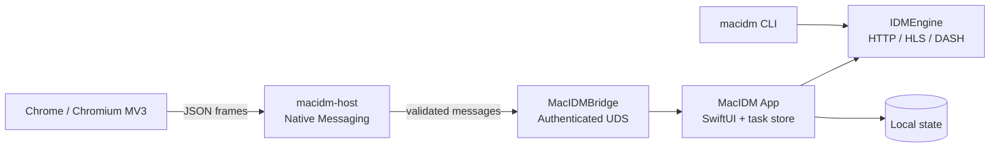

<div align="center">
  
  <h1>MacIDM</h1>
  <p><a href="README.en.md">English</a></p>
  <p><strong>基于 Swift、专为 macOS 打造、以低内存占用为设计目标的类 IDM 通用下载器</strong></p>
  <p>把网页里藏着的视频、音频和文件找出来，在原生 App 里确认，再用一个可靠、可控、隐私友好的下载内核把它们落到本地。</p>
  <p>
    
    
    
    
  </p>
  <p>
    <a href="https://github.com/Raters0/MacIDM/releases/tag/v1.0.0"><strong>下载 v1.0.0</strong></a> ·
    <a href="#快速开始"><strong>快速开始</strong></a> ·
    <a href="#2-加载-chrome-扩展"><strong>Chrome 扩展</strong></a>
  </p>
  <p></p>
</div>

## 目录

- [为什么选择 MacIDM](#为什么选择-macidm)
- [从网页发现到本地文件](#从网页发现到本地文件)
- [核心能力](#核心能力)
- [相比常见方案的设计取舍](#相比常见方案的设计取舍)
- [界面展示](#界面展示)
- [yt-dlp 与视频下载](#yt-dlp-与视频下载)
- [工作原理](#工作原理)
- [快速开始](#快速开始)
- [操作指南](#操作指南)
- [CLI 与本地 Agent API](#cli-与本地-agent-api)
- [从源码构建](#从源码构建)
- [测试](#测试)
- [目录结构](#目录结构)
- [隐私与本地数据](#隐私与本地数据)
- [致谢与许可证](#致谢与许可证)

## 为什么选择 MacIDM

下载这件事，不同场景的痛点并不一样。MacIDM 围绕三类真实需求来设计：

**普通大文件下载。** 你需要分段并发把带宽吃满、断点续传不怕中断、速度限制不抢网、任务队列按顺序跑完，以及一个可靠的本地任务管理界面。这些是下载器的基本功，MacIDM 用可验证的机制把它们做扎实：先做 Range 探测与响应校验，确认资源真的支持分段后才启用多连接；用强 ETag 与内容身份校验保证续传的是同一个资源；写盘使用绝对偏移，多个连接互不踩踏。

**网页里的视频和音频。** 它们的真实地址往往不摆在页面上，而是藏在网络请求、播放器状态、HLS/DASH 清单或接口返回的 JSON 里。MacIDM 让 Chrome 扩展负责"发现"，把候选交给你，再由原生 App 负责"确认和下载"。你始终掌握最终决定权——发现候选不会静默开始下载。

**自动化与开发工作流。** 你可能想用 CLI 或本地 API 编排下载，但又不希望把下载页面的标题、URL、本地路径和凭据随手送进日志或 AI 调试上下文。MacIDM 的日志与自动化接口默认做数据最小化，只暴露结构化状态和清理过的摘要。

一句话概括 MacIDM 的产品思路：

> 浏览器负责**发现**，原生 App 负责**下载**，用户负责**确认**。

它既不是一个只会收集链接的浏览器扩展，也不是一个与浏览器脱节的独立下载器，而是把网页媒体入口、可靠下载内核和 macOS 原生任务管理连成一条完整、可掌控的链路。

## 从网页发现到本地文件

媒体嗅探是 MacIDM 的特色入口。网页上的媒体地址来源五花八门，单一手段很容易漏，因此扩展采用多层发现互相补足：

1. **浏览器网络请求观察**——直接看到页面发出的媒体请求；
2. **Main World `fetch` / XHR 观察**——捕获页面脚本在主页世界发起的请求；
3. **响应类型与 magic-byte 判断**——不只看声明的 MIME，也看真实字节头；
4. **JSON 深度扫描**——从接口返回的嵌套结构里挖出媒体地址；
5. **DOM / Performance 资源观察**——兜底捕获播放器与资源加载痕迹。

发现只是第一步。扩展会对候选地址做**归一化、置信度判断和去重**，避免同一资源被重复列出。你可以通过三种入口使用它们：工具栏 **Popup**、媒体元素旁的**折叠悬浮按钮**、以及扫描整页链接的 **Download All**。无论哪个入口，**发现候选都不会静默开始下载**；你最终在 MacIDM 的确认窗口里核对名称、保存位置和下载选项，然后才真正创建任务。

扩展与本地 App 之间通过 **Native Messaging Host** 通信，本地桥接使用经过白名单校验的协议和鉴权的本地传输（Unix Domain Socket），扩展无法直接读写 App 的内部任务存储。

资源进入下载后，会按类型路由到对应的处理流程：


- **普通文件**走 HTTP 分段引擎：Range 探测、分段并发、断点续传、SHA-256 校验、原子发布最终文件；
- **HLS** 按分片计划下载，支持 AES-128 解密与 byte-range 分片，再用 FFmpeg 转封装为 MP4；
- **静态 DASH** 做音视频轨配对与合并；
- **Bilibili** 有专门的适配路径；
- **YouTube 等站点**交给 yt-dlp 做站点解析（见下节）。

## 核心能力

| 模块 | 能力 | 说明 |
| --- | --- | --- |
| 下载引擎 | HTTP 分段、Range 校验、强 ETag、断点续传、重试、SHA-256、绝对偏移写入 | 仅在响应校验通过后启用分段；不静默覆盖已有最终文件 |
| 并发与限速 | 1–64 并发请求、慢分段再切分、429/503 连接策略调整、全局与任务级 token-bucket 限速 | 并发与限速均可按任务或全局配置 |
| macOS App | SwiftUI 任务界面、队列、暂停/恢复、代理、完成动作、搜索与分类、中英文 | 任务确认与本地管理的中心 |
| 媒体链路 | HLS VOD、静态 DASH、Bilibili、yt-dlp 站点解析、FFmpeg/ffprobe 校验 | DRM 与直播流不在支持范围 |
| Chrome 扩展 | MV3 Popup、多层媒体发现、折叠悬浮入口、Download All、下载接管 | 负责发现，不负责静默下载 |
| 本地桥接 | Native Messaging + 鉴权 UDS + 严格 JSON 协议 | 扩展与 App 之间的唯一通道 |
| CLI | `add` / `status` / `pause` / `resume` / `cancel` / `inspect` / `watch` / `logs` 等，支持 JSON 输出 | 与引擎共享核心模型，不依赖 UI |
| 自动化 | localhost Agent HTTP API、状态快照 | 见 [docs/agent-http-api.md](docs/agent-http-api.md) |

## 相比常见方案的设计取舍

MacIDM 不试图在每个维度上"赢过"谁，而是做了一组明确的产品取舍：

| 类型 | 常见优势 | MacIDM 的取舍 |
| --- | --- | --- |
| 浏览器内下载扩展 | 收集链接方便、部署简单 | 扩展专注发现，下载交给原生引擎，以获得分段、续传、限速、队列、校验和自定义请求能力 |
| 媒体嗅探扩展 | 规则灵活、批量管理成熟 | 使用多层发现与置信度去重，并把候选交给 App 确认，而不是在页面里直接下载 |
| 传统跨平台下载器 | 功能全面、平台覆盖广 | 用 Swift / SwiftUI 专注 macOS，强调原生体验、流式处理和有界内存设计 |
| 视频下载工具 | 站点解析覆盖广 | 将 yt-dlp 作为重要的站点解析能力，与 App、扩展和任务管理整合，而非各自为政 |

这些取舍背后是一批可验证的实现：HTTP Range 探测与响应验证、1–64 并发配置、强 ETag 与内容身份校验的断点续传、慢分段再切分、429/503 下的连接策略调整、全局与任务级 token-bucket 限速、队列调度、SHA-256 校验与原子最终文件发布、HLS AES-128 / byte-range、静态 DASH 音视频配对与合并、Bilibili 适配路径，以及 yt-dlp 受管工具路径。

## 界面展示

**App 主界面。** 三栏布局：筛选边栏（状态、队列、时间、分类）、任务列表（大小、状态、速度、耗时、进度）与任务详情（总进度、分段进度、速度曲线、连接策略）。下图为真实界面截图，并开启了文件名遮罩以保护隐私。

<p align="center"></p>

**媒体发现与确认。** 输入或嗅探到 HLS/DASH 地址后，App 会解析出多个清晰度变体，列出分辨率、码率与预估大小，供你选择后再确认下载。下图为使用公开测试流拍摄的真实确认界面。

<p align="center"></p>

**Chrome Popup。** 轻量弹窗展示当前页面的媒体候选，提供下载按钮、刷新与"下载本页全部"，并支持主题与中英文界面。下图为界面示意图（interface preview）。

<p align="center"></p>

> 说明：以上截图与示意均使用中性示例数据（如 `example.com`、公开测试流），不含真实下载历史、URL、本地路径或敏感标题；Popup 一张为排版示意，非真实运行截图。

## yt-dlp 与视频下载

YouTube 及大量站点的媒体地址与格式选择逻辑复杂且经常变化。MacIDM 不重复造轮子，而是把 **[yt-dlp](https://github.com/yt-dlp/yt-dlp)** 作为重要的站点解析能力：yt-dlp 是一个功能丰富、覆盖大量站点的音视频下载命令行项目，MacIDM 在 YouTube 等站点的媒体解析与下载路径中使用并管理它（Release 版 App 已内置受管的 yt-dlp 二进制，运行时也可回退到本机已安装的版本）。

更重要的是整合：yt-dlp 解析出的候选会进入 MacIDM 的统一流程——浏览器发现、App 确认、清晰度选择、进度展示和本地任务管理，而不是一个孤立的命令行调用。

感谢 [yt-dlp](https://github.com/yt-dlp/yt-dlp) 项目及其贡献者，为站点媒体解析与视频下载提供了重要基础。yt-dlp 及其上游依赖仍适用各自的许可证。

## 工作原理



各层按长期职责分离：`IDMEngine` 是可复用的无 UI 下载内核，不依赖 CLI 或界面；`MacIDMBridge` 只负责消息协议、校验与鉴权传输；`MacIDMHost` 只做 Native Messaging 转发；扩展侧的页面发现与 Popup 展示保持独立。依赖方向单向收敛，便于测试与维护。

**低内存是如何做到的。** MacIDM 用原生 Swift / SwiftUI 编写，没有跨平台运行时负担；HLS/DASH 采用流式处理，分片边下载边写盘，而不是把整段媒体载入内存；媒体缓冲由 `MediaBufferBudget` 做有界的两阶段预留（任务级 + 全局级），并且全局预算会根据机器物理内存自动收紧或放宽——小内存设备更保守，大内存设备更从容。这些都是设计上的硬约束，而非营销话术。

## 快速开始

### 1. 下载 v1.0.0

前往 [Release v1.0.0](https://github.com/Raters0/MacIDM/releases/tag/v1.0.0) 下载：

- `MacIDM-v1.0.0-macos-development.app.zip`：macOS App；
- `MacIDM-v1.0.0-chrome-extension.zip`：Chrome 扩展；
- `SHA256SUMS.txt`：上述文件的 SHA-256 校验值，下载后建议先校验。

解压 App 压缩包，把 `MacIDM.app` 拖到"应用程序"或你习惯的位置。

### 2. 加载 Chrome 扩展

1. 打开 Chrome 的 `chrome://extensions`；
2. 开启右上角"开发者模式"；
3. 点击"加载已解压的扩展程序"，选择解压后的扩展目录（含 `manifest.json` 的那一层）；
4. 加载成功后工具栏会出现 MacIDM 图标。

### 3. 注册 Native Messaging Host

扩展需要通过 Native Messaging Host 与本地 App 通信。在解压的源码仓库中运行：

```bash
bash scripts/install-debug-native-host.sh   # 向已安装的 Chromium 系浏览器注册 Host
bash scripts/check-debug-native-host.sh     # 检查 Host 连通性
```

脚本会把 Host 清单指向已安装的 `MacIDM.app` 内的 `macidm-host`。如果你使用自定义 Chromium 配置目录，可用 `MACIDM_NMH_EXTRA_DIRS` 追加；使用动态生成的本地扩展 ID 时，可用 `MACIDM_NMH_ALLOWED_ORIGINS` 追加允许来源。

### 4. 完成第一次下载

- **普通 URL**：在 App 中点击"添加"，粘贴 HTTP(S) 地址并选择保存目录即可；
- **网页媒体**：打开含音视频的页面（必要时播放一次），点击工具栏 MacIDM 图标或媒体旁的悬浮按钮，在 Popup 中选择候选，然后在 App 确认窗口核对名称、位置与并发数，点击"开始下载"；
- **整页链接**：右键菜单或 Download All 页面扫描当前页链接，去重筛选后勾选批量提交；
- **任务控制**：在任务列表或详情中使用暂停、恢复、取消；在设置中调整全局速度限制、同时下载数、队列与代理。

## 操作指南

- **确认窗口**：下载前你可以改文件名、保存目录、最大并行请求数（1–64）、队列优先级，并可选填预期 SHA-256 做完整性校验；对 HLS/DASH 会先列出清晰度变体供选择。
- **队列与分类**：侧栏按状态、队列、时间和分类筛选；可为不同队列设置并发与完成动作。
- **限速与代理**：设置中提供全局速度限制（token-bucket）与代理配置；代理密码仅存于系统钥匙串。
- **登录态资源**：对需要登录的普通 GET 资源，只有在你明确授权当前站点 Cookie 后，扩展才会尝试重建请求上下文；POST、Authorization、复杂自定义头、`blob:` 与 DRM 会安全降级，不会假装能下。
- **文件名隐私**：设置中可开启文件名遮罩，列表与详情以任务 ID 显示，避免敏感文件名外泄（本文截图即开启该功能）。

## CLI 与本地 Agent API

CLI 与 App 共享下载内核，适合脚本与自动化：

```bash
swift build --product macidm

macidm add https://example.com/file.zip --output "$HOME/Downloads/file.zip" --parallel 8
macidm add https://example.com/file.zip --output /tmp/file.zip --sha256 <64位十六进制> --foreground
macidm inspect https://example.com/watch --media-kind hls   # 只解析变体，不下载
macidm status
macidm status <task-id> --json
macidm pause <task-id>
macidm resume <task-id>
macidm cancel <task-id>
macidm watch --interval 1.0     # 实时 TUI 监控
macidm logs --follow --lines 50 # 查看 App 日志
macidm app-status               # 一次性状态快照
```

全局选项：`--json` 输出机器可读 JSON；`--state-dir <path>` 覆盖 CLI 状态目录（默认 `~/Library/Application Support/MacIDM/cli/`）。带签名/查询串的 URL 不会被持久化，一次性下载请用 `--foreground`。

**本地 Agent API。** App 在 `127.0.0.1:7831` 暴露一个仅本机的 HTTP API，供脚本与 AI Agent 读取状态、控制任务，无需截图或 UI 自动化。除 `/health` 外均需每次启动生成的 `X-MacIDM-Token`。完整端点与安全边界见 [docs/agent-http-api.md](docs/agent-http-api.md)。

## 从源码构建

环境要求：macOS 13+；与 `Package.swift` 匹配的 Swift 6 / Xcode Command Line Tools；Node.js（扩展单元测试）；`ffmpeg` / `ffprobe`（HLS/DASH remux 校验）；YouTube 路径需要可解析的 `yt-dlp`（可用 `scripts/fetch-ytdlp.sh` 准备，Release App 已内置）。

```bash
git clone https://github.com/Raters0/MacIDM.git
cd MacIDM

swift build                      # 构建全部目标
swift build --product macidm     # 仅构建 CLI
swift run macidm --help          # 查看 CLI 用法
bash scripts/build-debug-app.sh  # 组装本地 MacIDM.app
```

组装本地 App 并安装、注册 Host：

```bash
bash scripts/install-debug-app.sh
bash scripts/install-debug-native-host.sh
bash scripts/check-debug-native-host.sh
open "$HOME/Applications/MacIDM.app"
```

安装脚本会拒绝覆盖正在运行的 MacIDM；请先确认没有活动下载再退出旧进程重试。

## 测试

基础门禁：

```bash
swift format lint --recursive --strict --configuration .swift-format Sources Tests Package.swift
swift test
swift build --product macidm
bash Tests/Integration/download-engine-integration.sh
bash Tests/Integration/hls-download-integration.sh
node --test Tests/BrowserExtensionTests/Unit/*.test.mjs
```

按变更范围追加：

```bash
# FFmpeg / 本地媒体 remux
bash Tests/Integration/ffmpeg-remux-integration.sh
bash Tests/Integration/app-media-pipeline-integration.sh

# YouTube / yt-dlp 路径（需要可解析的 yt-dlp；网络失败会被明确报告）
bash Tests/Integration/youtube-ytdlp-integration.sh

# DASH 路由或引擎基础变更
swift test --filter 'DASHParserTests|DASHDownloadExecutorTests|Phase5FoundationTests'
```

## 目录结构

```text
Sources/
├── IDMEngine/          可复用下载引擎：HTTP、HLS、DASH、FFmpeg 校验
├── MacIDMApp/          SwiftUI App、任务控制面、持久化与站点服务
├── MacIDMBridge/       消息协议、校验、鉴权 UDS 与 Native Messaging 帧
├── MacIDMHost/         Chrome Native Messaging 可执行 Host
└── MacIDMCLI/          CLI 参数、状态、持久化与 worker 编排

BrowserExtension/chrome/  Chrome MV3 扩展与生产资源
Tests/                    Swift/Node 单测、集成测试、fixture 与测试服务器
Resources/                App 图标、菜单栏资源与本地化
scripts/                  构建、安装、Host 注册与测试脚本
docs/agent-http-api.md    本地 Agent HTTP API 参考
```

## 隐私与本地数据

MacIDM 没有云端下载服务，核心下载与桥接都在本机完成。在此之上，项目做了一组"数据最小化"的设计，目的是减少隐私信息意外进入日志、自动化和 AI 调试流程：

- **普通日志默认脱敏**：省略或脱敏 URL、本地路径、页面与媒体标题等私密内容，只保留排障所需的结构信息；
- **私密诊断日志单独存放**：仅用于本机排障的完整诊断日志是一个独立的本地文件，默认排除在 Git、截图、Issue、普通支持包和自动上传之外；
- **凭据不落日志**：Cookie、Authorization、代理密码、桥接 token 等默认不记录原值，只记录存在性、来源、数量、过期/域匹配结果等结构信息；
- **自动化接口暴露清理过的摘要**：CLI 与 Agent API 优先返回结构化状态和清理后的摘要，减少不相关的页面文本、媒体标题和下载路径进入 AI 调试上下文。

需要说明：这是**数据最小化与减少意外暴露**的工程实践，不是用来绕过任何平台或 AI 的安全策略；它也不能保证你主动提供给他人的私密日志内容不会被处理。下载前请确认你拥有相应内容的保存与使用权限，并遵守目标网站、内容提供方及所在地区的法律与服务条款。

## 致谢与许可证

- 感谢 [yt-dlp](https://github.com/yt-dlp/yt-dlp) 项目及其贡献者，为站点媒体解析与视频下载提供了重要基础；
- FFmpeg / ffprobe 用于媒体转封装与校验，遵循其自身许可证；
- 其他第三方组件各自遵循其自身许可证。

本仓库以 [MIT License](LICENSE) 开源。
