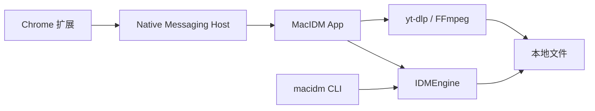

<div align="center">
  
  <h1>MacIDM</h1>
  <p>用 Swift 写的 macOS 下载器，带一个 Chrome 媒体嗅探扩展。</p>
  <p><a href="README.en.md">English</a> · <a href="https://github.com/Raters0/MacIDM/releases/tag/v1.0.0">下载 v1.0.0</a> · <a href="#快速开始">快速开始</a></p>
</div>

我想在 Mac 上做一个类似 IDM 的通用下载器：界面简单一点，下载时少占些内存，网页里的视频和音频也能顺手保存下来。于是有了 MacIDM。

App 用 Swift / SwiftUI 编写。普通文件下载、分段、续传和任务队列由自己的下载引擎处理，Chrome 扩展负责网页媒体嗅探。开发中花时间最多的是下载调度、媒体发现和内存控制，下面也主要介绍这几部分。

<table><tr><td></td></tr></table>

## 花时间打磨的地方

### 下载与内存

普通文件支持分段下载、暂停续传、队列和限速。并行请求数可以在 1–64 之间调整；遇到拖慢进度的分段会再切分，服务器返回 429 / 503 时也会调整连接策略。分段和续传前会检查 Range 响应与资源身份，避免拼接出错误文件。

低内存占用是我比较在意的一点。HLS / DASH 分片会边接收边写盘，缓冲有任务级和全局上限，预算会根据机器内存调整。这里先不放“占用多少 MB”的数字，实际使用量还会随任务数量和资源类型变化。

### 网页媒体嗅探

有些媒体地址能直接从网络请求里找到，有些藏在播放器脚本或接口返回的数据里。扩展同时观察网络请求、fetch / XHR、响应类型与字节头、JSON、DOM 和 Performance，再把找到的候选归一化、去重。

这部分除了尽量找全，也在处理重复候选、小音频和媒体分片带来的列表噪声，以及页面变化后候选的更新。相较于只收集链接的做法，我更想把“在页面里找到资源”和“交给本地下载器处理”接起来。

页面里的下载按钮默认折叠，点击后展开候选列表。选中资源后，再到 App 确认下载。下面演示浮窗的展开与收起：

<table><tr><td></td></tr></table>

演示视频：[Sintel](https://www.sintel.org/)，Blender Foundation。

工具栏 Popup 也能查看当前页的资源；“下载本页全部链接”用于收集和筛选整页链接。

<table><tr><td></td></tr></table>

### 任务界面与小工具

主窗口放任务列表、分类和下载详情，可以查看分段进度和速度曲线。新建任务时能改保存位置、文件名、并发数；HLS / DASH 有多个清晰度时会先列出来供选择。

<table><tr><td></td></tr></table>

此外还有代理、全局和任务限速、中英文界面，以及 CLI 和本地 HTTP API。喜欢用终端或脚本的话，可以从下面的命令行章节开始。

## 工作原理



- **普通文件**：下载引擎探测 Range 支持，校验分段响应，按绝对偏移写盘；支持续传和可选 SHA-256 校验。
- **HLS / 静态 DASH**：下载媒体分片，处理 HLS AES-128、byte-range 和 DASH 音视频轨；需要时调用 FFmpeg 转封装或合并。Bilibili 有单独的适配代码。
- **YouTube 等页面**：调用 [yt-dlp](https://github.com/yt-dlp/yt-dlp) 解析格式和下载；其他视频网站在常规发现未找到资源时，也会尝试 yt-dlp 的通用解析作为兜底。感谢这个项目和它的贡献者，省去了很多站点适配工作。
- **扩展与 App**：通过 Native Messaging Host 和经过鉴权的本地 Unix socket 通信。页面候选是临时数据，确认后才创建下载任务。

引擎、App、CLI 和桥接层是独立的 Swift target。扩展里的页面观察、Popup 和共享数据处理也分别放置，方便单独测试和修改。

## 快速开始

### 1. 下载 v1.0.0

前往 [Release v1.0.0](https://github.com/Raters0/MacIDM/releases/tag/v1.0.0) 下载：

- `MacIDM-v1.0.0-macos-development.app.zip`：macOS App；
- `MacIDM-v1.0.0-chrome-extension.zip`：Chrome 扩展；
- `SHA256SUMS.txt`：上述文件的 SHA-256 校验值，下载后建议先校验。

解压 App 压缩包，把 `MacIDM.app` 放到 `~/Applications/`。下面的 Host 注册脚本默认使用这个位置；如果放在 `/Applications/`，运行注册脚本时加上 `MACIDM_DEBUG_INSTALL_DIRECTORY=/Applications`。

### 2. 加载 Chrome 扩展

1. 打开 Chrome 的 `chrome://extensions`；
2. 开启右上角"开发者模式"；
3. 点击"加载已解压的扩展程序"，选择解压后的扩展目录（含 `manifest.json` 的那一层）；
4. 加载成功后工具栏会出现 MacIDM 图标。

### 3. 注册 Native Messaging Host

扩展需要通过 Native Messaging Host 与本地 App 通信。在解压的源码仓库中运行：

```bash
bash scripts/install-debug-native-host.sh   # 向已安装的 Chromium 系浏览器注册 Host
bash scripts/check-debug-native-host.sh     # 检查 Host 连通性
```

脚本会把 Host 清单指向已安装的 `MacIDM.app` 内的 `macidm-host`。如果你使用自定义 Chromium 配置目录，可用 `MACIDM_NMH_EXTRA_DIRS` 追加；使用动态生成的本地扩展 ID 时，可用 `MACIDM_NMH_ALLOWED_ORIGINS` 追加允许来源。

### 4. 完成第一次下载

- **普通 URL**：在 App 中点击"添加"，粘贴 HTTP(S) 地址并选择保存目录即可；
- **网页媒体**：打开含音视频的页面（必要时播放一次），点击工具栏 MacIDM 图标或媒体旁的悬浮按钮，在 Popup 中选择候选，然后在 App 确认窗口核对名称、位置与并发数，点击"开始下载"；
- **整页链接**：右键菜单或 Download All 页面扫描当前页链接，去重筛选后勾选批量提交；
- **任务控制**：在任务列表或详情中使用暂停、恢复、取消；在设置中调整全局速度限制、同时下载数、队列与代理。

## 操作指南

- **确认窗口**：下载前你可以改文件名、保存目录、最大并行请求数（1–64）、队列优先级，并可选填预期 SHA-256 做完整性校验；对 HLS/DASH 会先列出清晰度变体供选择。
- **队列与分类**：侧栏按状态、队列、时间和分类筛选；可为不同队列设置并发与完成动作。
- **限速与代理**：设置中提供全局速度限制（token-bucket）与代理配置；代理密码仅存于系统钥匙串。
- **登录态资源**：对需要登录的普通 GET 资源，只有在你明确授权当前站点 Cookie 后，扩展才会尝试重建请求上下文；POST、Authorization、复杂自定义头、`blob:` 与 DRM 会安全降级。
- **文件名隐私**：设置中可开启文件名遮罩，列表与详情以任务 ID 显示，避免敏感文件名外泄。

## CLI 与本地 Agent API

CLI 与 App 共享下载内核，适合脚本与自动化：

```bash
swift build --product macidm
export PATH="$PWD/.build/debug:$PATH"

macidm add https://example.com/file.zip --output "$HOME/Downloads/file.zip" --parallel 8
macidm add https://example.com/file.zip --output /tmp/file.zip --sha256 <64位十六进制> --foreground
macidm inspect https://example.com/watch --media-kind hls   # 只解析变体，不下载
macidm status
macidm status <task-id> --json
macidm pause <task-id>
macidm resume <task-id>
macidm cancel <task-id>
macidm watch --interval 1.0     # 实时 TUI 监控
macidm logs --follow --lines 50 # 查看 App 日志
macidm app-status               # 一次性状态快照
```

全局选项：`--json` 输出机器可读 JSON；`--state-dir <path>` 覆盖 CLI 状态目录（默认 `~/Library/Application Support/MacIDM/cli/`）。带签名/查询串的 URL 不会被持久化，一次性下载请用 `--foreground`。

**本地 Agent API。** App 在 `127.0.0.1:7831` 暴露一个仅本机的 HTTP API，供脚本与 AI Agent 读取状态、控制任务，无需截图或 UI 自动化。除 `/health` 外均需每次启动生成的 `X-MacIDM-Token`。完整端点与安全边界见 [docs/agent-http-api.md](docs/agent-http-api.md)。

## 从源码构建

环境要求：macOS 13+；与 `Package.swift` 匹配的 Swift 6 / Xcode Command Line Tools；Node.js（扩展单元测试）；`ffmpeg` / `ffprobe`（HLS/DASH remux 校验）；YouTube 路径需要可解析的 `yt-dlp`（可用 `scripts/fetch-ytdlp.sh` 准备，Release App 已内置）。

```bash
git clone https://github.com/Raters0/MacIDM.git
cd MacIDM

swift build                      # 构建全部目标
swift build --product macidm     # 仅构建 CLI
swift run macidm --help          # 查看 CLI 用法
bash scripts/build-debug-app.sh  # 组装本地 MacIDM.app
```

组装本地 App 并安装、注册 Host：

```bash
bash scripts/install-debug-app.sh
bash scripts/install-debug-native-host.sh
bash scripts/check-debug-native-host.sh
open "$HOME/Applications/MacIDM.app"
```

安装脚本会拒绝覆盖正在运行的 MacIDM；请先确认没有活动下载再退出旧进程重试。

## 测试

常用检查：

```bash
swift format lint --recursive --strict --configuration .swift-format Sources Tests Package.swift
swift test
swift build --product macidm
bash Tests/Integration/download-engine-integration.sh
bash Tests/Integration/hls-download-integration.sh
node --test Tests/BrowserExtensionTests/Unit/*.test.mjs
```

按变更范围追加：

```bash
# FFmpeg / 本地媒体 remux
bash Tests/Integration/ffmpeg-remux-integration.sh
bash Tests/Integration/app-media-pipeline-integration.sh

# YouTube / yt-dlp 路径（需要可解析的 yt-dlp；网络失败会被明确报告）
bash Tests/Integration/youtube-ytdlp-integration.sh

# DASH 路由或引擎基础变更
swift test --filter 'DASHParserTests|DASHDownloadExecutorTests|Phase5FoundationTests'
```

## 目录结构

```text
Sources/
├── IDMEngine/          可复用下载引擎：HTTP、HLS、DASH、FFmpeg 校验
├── MacIDMApp/          SwiftUI App、任务控制面、持久化与站点服务
├── MacIDMBridge/       消息协议、校验、鉴权 UDS 与 Native Messaging 帧
├── MacIDMHost/         Chrome Native Messaging 可执行 Host
└── MacIDMCLI/          CLI 参数、状态、持久化与 worker 编排

BrowserExtension/chrome/  Chrome MV3 扩展与生产资源
Tests/                    Swift/Node 单测、集成测试、fixture 与测试服务器
Resources/                App 图标、菜单栏资源与本地化
scripts/                  构建、安装、Host 注册与测试脚本
docs/agent-http-api.md    本地 Agent HTTP API 参考
```

## 隐私与本地数据

下载和任务管理都在本机完成。设置里可以隐藏文件名，普通日志也会省略页面标题、完整 URL 和本地路径；需要详细排障时，另有单独的本地诊断日志。Cookie、Authorization、代理密码和桥接 token 默认不记录原值。

做这部分时也考虑了用 AI 辅助调试的习惯：排查速度、重试或任务状态，通常不需要把下载内容的标题和地址一并交出去。先看普通日志，需要时再按具体任务查看详细诊断；分享日志前检查一下内容即可。

## 致谢与许可证

- 感谢 [yt-dlp](https://github.com/yt-dlp/yt-dlp) 项目及其贡献者，为站点媒体解析与视频下载提供了重要基础；
- FFmpeg / ffprobe 用于媒体转封装与校验，遵循其自身许可证；
- 其他第三方组件各自遵循其自身许可证。

本仓库以 [MIT License](LICENSE) 开源。
