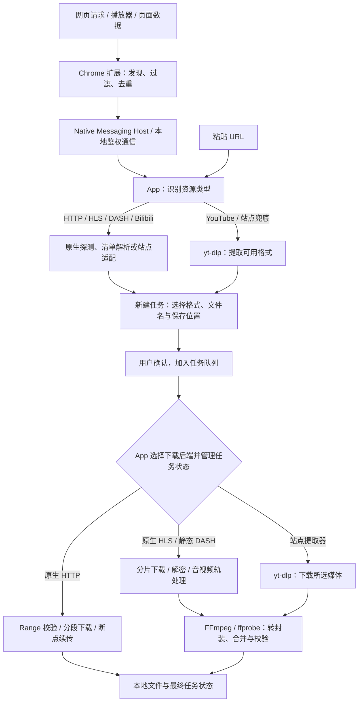

<div align="center">
  
  <h1>MacIDM</h1>
  <p>用 Swift 写的原生 macOS 媒体资源下载器，以流式处理和有界内存占用为设计目标，带一个 Chrome 媒体嗅探扩展。</p>
  <p><a href="README.md">English</a> · <a href="https://github.com/Raters0/MacIDM/releases">下载</a> · <a href="#快速开始">快速开始</a></p>
</div>

MacIDM 是一款使用 Swift / SwiftUI 编写的 macOS 媒体资源下载器，支持浏览器媒体嗅探、分段下载、断点续传等功能。由于 [Internet Download Manager（IDM）](https://www.internetdownloadmanager.com/) 目前仍 [没有 macOS 版本](https://www.internetdownloadmanager.com/register/new_faq/functions2.html)，因此制作了这款软件，包含一个 Chrome 扩展和一个 App。

<p></p>

## 核心功能

### 网页媒体嗅探

1. 网页扩展负责发现和选择资源，下载由本地 App 及其下载后端执行；也可以直接在 App 中填写下载链接。

下面演示点击视频 / 音频资源右上角的悬浮按钮、展开资源、点击下载，并打开 App 新建任务窗口的流程：

<p></p>


2. 浏览器扩展工具栏 Popup 可以嗅探当前页面的全部媒体资源。

<table><tr><td></td></tr></table>

### 任务管理与其他功能

- App 主窗口提供任务列表、分类和下载详情，可查看分段进度与速度曲线。
- 新建任务时可修改保存位置、文件名与并发数；HLS / DASH 有多个清晰度时会先列出供选择。
- 还支持代理、全局限速、中英文界面，以及 CLI 和本地 HTTP API。命令行可用于读取状态、控制任务和自动化脚本。
- 支持文件名隐藏，避免触发 AI Agent 敏感词检测。
- 支持日志分级存储；使用 AI 辅助调试时，可减少敏感信息（例如 Cookie）暴露给第三方。

### 已专门优化的主流网站

- [B站](https://www.bilibili.com/)
- [油管](https://www.youtube.com/)
- [抖音](https://www.douyin.com/)
- [X / 推特](https://www.x.com/)

### 下一步的更新计划

- 增加更多对 AI Agent 的支持，例如 MCP 和 AI 资源解析等。
- 针对更多网站做嗅探优化。

## 工作原理

下载分为资源发现、解析与确认、任务执行三个步骤。嗅探到的地址不一定是最终文件：它可能是媒体清单，也可能需要进一步解析的站点页面。



**资源解析。** 普通文件探测大小和 Range 支持；HLS / DASH 解析清单与可用清晰度；Bilibili 使用专门的适配代码。YouTube 调用 [yt-dlp](https://github.com/yt-dlp/yt-dlp) 提取格式；其他视频网站在常规发现未找到资源时，也会尝试 yt-dlp 的通用提取器。

**任务执行。** App 选择下载后端，并管理队列、并发、暂停、恢复和最终状态。`IDMEngine` 处理普通 HTTP、HLS 和静态 DASH：校验 HTTP 分段响应并按绝对偏移写盘，支持 HLS AES-128 和 byte-range，并处理 DASH 独立音视频轨。站点提取器后端由 yt-dlp 下载所选媒体；HLS、DASH 和站点媒体随后按需由 FFmpeg 转封装或合并，并用 ffprobe 校验。媒体缓冲受任务级和全局内存预算约束。

**本地通信。** 扩展通过 Native Messaging Host 与 App 的鉴权 Unix socket 通信。发现的候选临时保存在内存中，用户确认后才保存为下载任务。CLI 独立使用同一个下载引擎；本地 HTTP API 则用于读取和控制 App 中的任务。

## 快速开始

### 1. 下载

前往 [Release](https://github.com/Raters0/MacIDM/releases) 下载：

- `MacIDM-*-macos-development.app.zip`：macOS App；
- `MacIDM-*-chrome-extension.zip`：Chrome 扩展；
- `SHA256SUMS.txt`：上述文件的 SHA-256 校验值，下载后建议先校验。

解压 App 压缩包，把 `MacIDM.app` 放到 `~/Applications/`。下面的 Host 注册脚本默认使用这个位置；如果放在 `/Applications/`，运行注册脚本时加上 `MACIDM_DEBUG_INSTALL_DIRECTORY=/Applications`。

### 2. 加载 Chrome 扩展

1. 打开 Chrome 的 `chrome://extensions`；
2. 开启右上角"开发者模式"；
3. 点击"加载已解压的扩展程序"，选择解压后的扩展目录（含 `manifest.json` 的那一层）；
4. 加载成功后工具栏会出现 MacIDM 图标。

### 3. 注册 Native Messaging Host

扩展需要通过 Native Messaging Host 与本地 App 通信。在解压的源码仓库中运行：

```bash
bash scripts/install-debug-native-host.sh   # 向已安装的 Chromium 系浏览器注册 Host
bash scripts/check-debug-native-host.sh     # 检查 Host 连通性
```

脚本会把 Host 清单指向已安装的 `MacIDM.app` 内的 `macidm-host`。如果你使用自定义 Chromium 配置目录，可用 `MACIDM_NMH_EXTRA_DIRS` 追加；使用动态生成的本地扩展 ID 时，可用 `MACIDM_NMH_ALLOWED_ORIGINS` 追加允许来源。

### 4. 完成第一次下载
 
 - **普通 URL**：在 App 中点击"添加"，粘贴 HTTP(S) 地址并选择保存目录即可；
 - **网页媒体**：打开含音视频的页面（必要时播放一次），点击工具栏 MacIDM 图标或媒体旁的悬浮按钮，在 Popup 中选择候选，然后在 App 确认窗口核对名称、位置与并发数，点击"开始下载"；
 - **整页链接**：右键菜单或 Download All 页面扫描当前页链接，去重筛选后勾选批量提交；
 - **任务控制**：在任务列表或详情中使用暂停、恢复、取消；在设置中调整全局速度限制、同时下载数、队列与代理。

## 操作指南

- **确认窗口**：下载前你可以改文件名、保存目录、最大并行请求数（1–64）、队列优先级，并可选填预期 SHA-256 做完整性校验；对 HLS/DASH 会先列出清晰度变体供选择。
- **队列与分类**：侧栏按状态、队列、时间和分类筛选；可为不同队列设置并发、排序方式和定时窗口。
- **限速与代理**：设置中提供全局速度限制（token-bucket）与代理配置；代理密码仅存于系统钥匙串。
- **登录态资源**：对需要登录的普通 GET 资源，只有在你明确授权当前站点 Cookie 后，扩展才会尝试重建请求上下文；POST、Authorization、复杂自定义头、`blob:` 与 DRM 会安全降级。
- **文件名隐私**：设置中可开启文件名遮罩，列表与详情会显示任务标识而非文件名。

## CLI 与本地 Agent API

CLI 独立使用与 App 相同的下载内核，可用于脚本和自动化：

```bash
swift build --product macidm
export PATH="$PWD/.build/debug:$PATH"

macidm add https://example.com/file.zip --output "$HOME/Downloads/file.zip" --parallel 8
macidm add https://example.com/file.zip --output /tmp/file.zip --sha256 <64位十六进制> --foreground
macidm inspect https://example.com/watch --media-kind hls   # 只解析变体，不下载
macidm status
macidm status <task-id> --json
macidm pause <task-id>
macidm resume <task-id>
macidm cancel <task-id>
macidm watch --interval 1.0     # 实时 TUI 监控
macidm logs --follow --lines 50 # 查看 App 日志
macidm app-status               # 一次性状态快照
```

全局选项：`--json` 输出机器可读 JSON；`--state-dir <path>` 覆盖 CLI 状态目录（默认 `~/Library/Application Support/MacIDM/cli/`）。带签名/查询串的 URL 不会被持久化，一次性下载请用 `--foreground`。

**本地 Agent API。** App 在 `127.0.0.1:7831` 暴露一个仅本机的 HTTP API，供脚本与 AI Agent 读取状态、控制任务，无需截图或 UI 自动化。除 `/health` 外均需每次启动生成的 `X-MacIDM-Token`。完整端点与安全边界见 [docs/agent-http-api.md](docs/agent-http-api.md)。

## 从源码构建

环境要求：macOS 13+；与 `Package.swift` 匹配的 Swift 6 / Xcode Command Line Tools；Node.js（扩展单元测试）；`ffmpeg` / `ffprobe`（HLS/DASH remux 校验）；YouTube 路径需要可解析的 `yt-dlp`（可用 `scripts/fetch-ytdlp.sh` 准备，Release App 已内置）。

```bash
git clone https://github.com/Raters0/MacIDM.git
cd MacIDM

swift build                      # 构建全部目标
swift build --product macidm     # 仅构建 CLI
swift run macidm --help          # 查看 CLI 用法
bash scripts/build-debug-app.sh  # 组装本地 MacIDM.app
```

组装本地 App 并安装、注册 Host：

```bash
bash scripts/install-debug-app.sh
bash scripts/install-debug-native-host.sh
bash scripts/check-debug-native-host.sh
open "$HOME/Applications/MacIDM.app"
```

安装脚本会拒绝覆盖正在运行的 MacIDM；请先确认没有活动下载再退出旧进程重试。

## 测试

常用检查：

```bash
swift format lint --recursive --strict --configuration .swift-format Sources Tests Package.swift
swift test
swift build --product macidm
bash Tests/Integration/download-engine-integration.sh
bash Tests/Integration/hls-download-integration.sh
node --test Tests/BrowserExtensionTests/Unit/*.test.mjs
```

按变更范围追加：

```bash
# FFmpeg / 本地媒体 remux
bash Tests/Integration/ffmpeg-remux-integration.sh
bash Tests/Integration/app-media-pipeline-integration.sh

# YouTube / yt-dlp 路径（需要可解析的 yt-dlp；网络失败会被明确报告）
bash Tests/Integration/youtube-ytdlp-integration.sh

# DASH 路由或引擎基础变更
swift test --filter 'DASHParserTests|DASHDownloadExecutorTests|Phase5FoundationTests'
```

## 目录结构

```text
Sources/
├── IDMEngine/          可复用下载引擎：HTTP、HLS、DASH、FFmpeg 校验
├── MacIDMApp/          SwiftUI App、任务控制面、持久化与站点服务
├── MacIDMBridge/       消息协议、校验、鉴权 UDS 与 Native Messaging 帧
├── MacIDMHost/         Chrome Native Messaging 可执行 Host
└── MacIDMCLI/          CLI 参数、状态、持久化与 worker 编排

BrowserExtension/chrome/  Chrome MV3 扩展与生产资源
Tests/                    Swift/Node 单测、集成测试、fixture 与测试服务器
Resources/                App 图标、菜单栏资源与本地化
scripts/                  构建、安装、Host 注册与测试脚本
docs/agent-http-api.md    本地 Agent HTTP API 参考
```

## 隐私与本地数据

下载和任务管理都在本机完成。设置里可以隐藏文件名，普通日志也会省略页面标题、完整 URL 和本地路径；需要详细排障时，另有单独的本地诊断日志。Cookie、Authorization、代理密码和桥接 token 默认不记录原值。

使用 AI 辅助调试时，排查速度、重试或任务状态，通常不需要把下载内容的标题和地址一并交出去。先看普通日志，需要时再按具体任务查看详细诊断；分享日志前检查一下内容即可。

## 致谢与许可证

- [yt-dlp](https://github.com/yt-dlp/yt-dlp) 提供站点媒体解析与下载支持；
- FFmpeg / ffprobe 用于媒体转封装与校验，遵循其自身许可证；
- 其他第三方组件各自遵循其自身许可证。

本仓库以 [MIT License](LICENSE) 开源。
